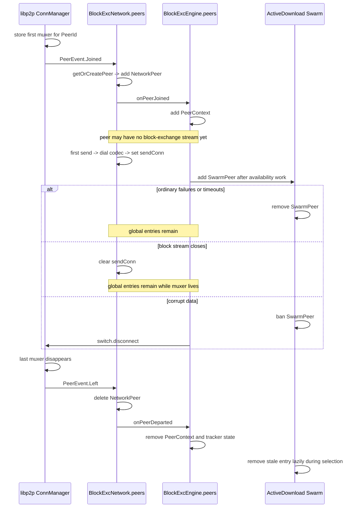

---
tags:
  - logos-storage/block-exchange
  - logos-storage/libp2p
  - logos-storage/peers
related:
  - "[[Libp2p connections - connect vs dial]]"
  - "[[Closing libp2p connections and streams]]"
  - "[[New Logos Storage Block Exchange Protocol]]"
  - "[[New Logos Storage Download Flow]]"
  - "[[Block Exchange Peer Performance and BDP]]"
  - "[[Libp2p Connection Lifecycle in Logos Storage]]"
  - "[[New Logos Storage Discovery]]"
  - "[[Mix Discovery through Provider Records]]"
---
# Block Exchange Peer Stores

> [!info] Source baseline
> This note describes `logos-storage-nim` `master` at commit `81f0d053`
> (2026-07-20), together with the vendored nim-libp2p connection manager.

Logos Storage block exchange has two node-wide collections keyed by
`PeerId`:

```nim
BlockExcNetwork.peers : Table[PeerId, NetworkPeer]
BlockExcEngine.peers  : PeerContextStore
                          └── OrderedTable[PeerId, PeerContext]
```

They normally acquire and lose the same peer at almost the same time, but they store different state and are mutated by different functions.

The short answer is:

```text
first libp2p muxer for a peer
  -> PeerEvent.Joined
  -> add NetworkPeer
  -> add PeerContext

last libp2p muxer for that peer disappears
  -> PeerEvent.Left
  -> remove NetworkPeer
  -> remove PeerContext and global in-flight tracking
```

Neither collection is scoped to one download. Finishing a download, closing a block-exchange stream, or removing a poorly performing peer from one download's swarm does not normally remove either node-wide entry.

## What each store represents

### `BlockExcNetwork.peers`

`BlockExcNetwork` is the mounted `/storage/blockexc/1.0.0` protocol:

```nim
type
  BlockExcNetwork* = ref object of LPProtocol
    peers*: Table[PeerId, NetworkPeer]
    excludedPeers: HashSet[PeerId]
    switch*: Switch
    handlers*: BlockExcHandlers
    request*: BlockExcRequest
    getConn: ConnProvider
    inflightSema: AsyncSemaphore
    maxInflight: int = DefaultMaxInflight
    trackedFutures*: TrackedFutures = TrackedFutures()
```

One `NetworkPeer` holds the application-protocol state used to communicate
with that peer:

```nim
type
  NetworkPeer* = ref object of RootObj
    id*: PeerId
    handler*: RPCHandler
    wantBlocksHandler*: WantBlocksRequestHandler
    sendConn: Connection
    getConn: ConnProvider
    yieldInterval*: Duration = DefaultYieldInterval
    trackedFutures: TrackedFutures
    pendingWantBlocksRequests*: Table[uint64, WantBlocksResponseFuture]
    nextRequestId*: uint64
```

The object owns:

- a lazy connection provider for `/storage/blockexc/1.0.0`;
- the retained outgoing application stream, `sendConn`;
- its outgoing read-loop task;
- request-ID allocation;
- pending `WantBlocks` response futures;
- callbacks for received control messages and block requests.

Membership in `BlockExcNetwork.peers` does **not** imply that `sendConn`
already exists. The node can have a physical libp2p connection to a peer and a
`NetworkPeer` object before either side negotiates the block-exchange codec.

### `BlockExcEngine.peers`

The engine refers to the shared `PeerContextStore`:

```nim
type
  BlockExcEngine* = ref object of RootObj
    localStore*: BlockStore
    network*: BlockExcNetwork
    peers*: PeerContextStore
    trackedFutures: TrackedFutures
    blockexcRunning: bool
    downloadManager*: DownloadManager
    discovery*: DiscoveryEngine
    advertiser*: Advertiser
    lastDiscRequest: Moment
    selectionPolicy*: SelectionPolicy
    activeDownloads*: HashSet[uint64]
```

The store is a thin wrapper around an ordered table:

```nim
type PeerContextStore* = ref object of RootObj
  peers*: OrderedTable[PeerId, PeerContext]

func add*(self: PeerContextStore, peer: PeerContext) =
  self.peers[peer.id] = peer

func remove*(self: PeerContextStore, peerId: PeerId) =
  self.peers.del(peerId)

func get*(self: PeerContextStore, peerId: PeerId): PeerContext =
  self.peers.getOrDefault(peerId, nil)
```

A `PeerContext` stores engine-level performance and busy state:

```nim
type PeerContext* = ref object of RootObj
  id*: PeerId
  stats*: PeerPerfStats
  wantListBusy*: bool

proc new*(T: type PeerContext, id: PeerId): PeerContext =
  PeerContext(id: id, stats: PeerPerfStats.new())
```

Its `PeerPerfStats` supplies RTT, throughput, adaptive pipeline depth, and
batch timeout calculations. That state is shared across all active downloads
using the peer.

### They are created from one shared `PeerContextStore`

`StorageServer.new` constructs the store once and passes it both to
`DiscoveryEngine` and `BlockExcEngine`:

```nim
let
  peerStore = PeerContextStore.new()
  downloadManager = DownloadManager.new(retries = config.blockRetries)
  advertiser = Advertiser.new(repoStore, discovery)
  blockDiscovery =
    DiscoveryEngine.new(repoStore, peerStore, network, discovery)
  engine = BlockExcEngine.new(
    repoStore, network, blockDiscovery, advertiser, peerStore, downloadManager
  )
```

`DiscoveryEngine.peers` and `BlockExcEngine.peers` therefore reference the
same `PeerContextStore`. The current discovery loop does not add or remove
contexts itself; it uses the network connection handoff, whose peer events
eventually update the store.

## The third peer collection: per-download `Swarm.peers`

There is also a third collection that must not be confused with the two
node-wide stores:

```nim
type Swarm* = ref object
  config*: SwarmConfig
  peers: Table[PeerId, SwarmPeer]
  removedPeers: HashSet[PeerId]
```

Every `ActiveDownload` has its own `Swarm`. A `SwarmPeer` holds availability,
last-seen time, failure count, and timeout count for that one download.

| Collection | Scope | Main state |
| --- | --- | --- |
| `BlockExcNetwork.peers` | Node and peer | Application stream and request correlation |
| `BlockExcEngine.peers` | Node and peer | Shared performance and handler state |
| `ActiveDownload.ctx.swarm.peers` | One download and peer | Availability, staleness, failures, timeouts |

Removing a `SwarmPeer` often leaves both node-wide entries intact.

## Per-download swarm admission is currently too broad

The node-wide `BlockExcEngine.peers` store answers the question “Which peers currently have a block-exchange peer context?” The per-download `Swarm` should answer the narrower question “Which peers are candidates for this particular manifest and its block tree?” The current download startup path does not preserve that distinction.

When `downloadWorker` starts, the worker copies peers from the node-wide store, randomly truncates the sequence to the per-download `deltaMax`, and sends the initial `WantHave` window to the selected peers:

```nim
var connectedPeers = self.peers.toSeq()
if connectedPeers.len > maxSwarmPeers:
  shuffle(connectedPeers)
  connectedPeers.setLen(maxSwarmPeers)

await self.broadcastWantHave(download, windowStart, windowCount, connectedPeers)
```

`broadcastWantHave` then calls `download.addPeerIfAbsent` before sending each request. A peer admitted through this path is initially only an unverified candidate: the node knows that the peer is connected, but does not yet know that the peer provides the requested manifest or any block in the requested window.

This broad admission can fill the bounded per-download swarm with unrelated peers before a provider discovered specifically for the manifest CID is admitted. Random selection limits the number of probes, but random selection does not prioritize peers with evidence that they provide the requested content. Provider records returned for the manifest CID should therefore be the preferred source of per-download candidates. Arbitrary connected peers can remain a fallback probe source when discovery has not supplied enough candidates.

There is also a concrete consistency problem in `ActiveDownload.addPeerIfAbsent`:

```nim
discard download.ctx.swarm.addPeer(peerId, availability)
return true
```

`Swarm.addPeer` returns `false` when the peer was previously removed from the download or when the swarm has reached `deltaMax`. `ActiveDownload.addPeerIfAbsent` discards that result and reports `true`, so the caller can send `WantHave` to a peer that was not actually inserted into the download's swarm. The eventual presence response may still fail to add the peer for the same capacity reason. `ActiveDownload.addPeerIfAbsent` should return the result of `Swarm.addPeer`, and later admission work should define how a newly discovered provider can replace a lower-value unverified candidate when the swarm is full.

## Normal insertion path

### 1. A first libp2p muxer is stored

A peer may arrive through:

- provider discovery followed by `switch.connect`;
- manifest fetching through `switch.dial(peerId, addresses, codec)`;
- manual `StorageNode.connect`;
- an incoming libp2p connection;
- any other mounted protocol that establishes switch-level connectivity.

After transport dialing or acceptance, Noise security, and Yamux negotiation,
the connection manager stores the muxer:

```nim
proc storeMuxer*(
    c: ConnManager, muxer: Muxer
) {.async: (raises: [CancelledError, LPError]).} =
  let
    peerId = muxer.connection.peerId
    dir = muxer.connection.dir
    peerConnsCount = c.muxerStore.count(peerId)
    isNewPeer = peerConnsCount == 0

  if not c.muxerStore.add(muxer):
    raise newException(LPError, "muxer already stored")

  if isNewPeer and not c.peerStore.isNil:
    c.peerStore.markPeerConnected(peerId)

  c.onCloseFuts.trackFut(c.onClose(muxer))

  let connectedEvent = c.triggerConnEvent(
    peerId, ConnEvent(kind: ConnEventKind.Connected, incoming: dir == Direction.In)
  )

  c.notifyPeerReady(peerId)
  await connectedEvent

  var joinedEvent: Future[void].Raising([CancelledError])
  if isNewPeer:
    joinedEvent = c.triggerPeerEvents(
      peerId, PeerEvent(kind: PeerEventKind.Joined, initiator: dir == Direction.Out)
    )
    c.peerEventFuts.trackFut(joinedEvent)
```

`PeerEvent.Joined` is emitted only when `peerConnsCount == 0`, meaning this is
the peer's first stored muxer.

A second incoming or outgoing physical connection to the same peer emits a
per-connection `Connected` event, but not another peer-level `Joined`. Both
block-exchange stores remain one entry per `PeerId`.

### 2. `BlockExcNetwork` receives `PeerEvent.Joined`

`BlockExcNetwork.init` registers one switch-wide handler for joined and left
events:

```nim
proc peerEventHandler(
    peerId: PeerId, event: PeerEvent
): Future[void] {.async: (raises: [CancelledError]).} =
  if event.kind == PeerEventKind.Joined:
    await self.handlePeerJoined(peerId)
  elif event.kind == PeerEventKind.Left:
    await self.handlePeerDeparted(peerId)
  else:
    warn "Unknown peer event", event

self.switch.addPeerEventHandler(peerEventHandler, PeerEventKind.Joined)
self.switch.addPeerEventHandler(peerEventHandler, PeerEventKind.Left)
```

These are switch peer events, not “block-exchange codec negotiated” events.
Consequently, a manifest-only connection can still cause both block-exchange
peer stores to be populated.

### 3. `NetworkPeer` is added first

The joined handler skips configured MIX relay peers, then calls
`getOrCreatePeer`:

```nim
proc handlePeerJoined*(
    self: BlockExcNetwork, peer: PeerId
) {.async: (raises: [CancelledError]).} =
  if peer in self.excludedPeers:
    return
  discard self.getOrCreatePeer(peer)
  if not self.handlers.onPeerJoined.isNil:
    await self.handlers.onPeerJoined(peer)
```

`getOrCreatePeer` is idempotent by `PeerId`:

```nim
proc getOrCreatePeer(self: BlockExcNetwork, peer: PeerId): NetworkPeer =
  if peer in self.peers:
    return self.peers.getOrDefault(peer, nil)

  var getConn: ConnProvider = proc(): Future[Connection] {.
      async: (raises: [CancelledError])
  .} =
    try:
      trace "Getting new connection stream", peer
      return await self.switch.dial(peer, Codec)
    except CancelledError as error:
      raise error
    except CatchableError as exc:
      trace "Unable to connect to blockexc peer", exc = exc.msg

  let rpcHandler = proc(p: NetworkPeer, msg: Message) {.async: (raises: []).} =
    await self.rpcHandler(p, msg)

  let wantBlocksHandler = proc(
      peerId: PeerId, req: WantBlocksRequest
  ): Future[seq[BlockDelivery]] {.async: (raises: [CancelledError]).} =
    return await self.handlers.onWantBlocksRequest(peerId, req)

  let blockExcPeer =
    NetworkPeer.new(peer, getConn, rpcHandler, wantBlocksHandler)

  self.peers[peer] = blockExcPeer
  return blockExcPeer
```

The assignment:

```nim
self.peers[peer] = blockExcPeer
```

is the normal insertion into `BlockExcNetwork.peers`.

Notice that the `getConn` closure only describes how to open a future
block-exchange stream. It does not dial during `NetworkPeer` construction.

### 4. The engine callback adds `PeerContext`

Only after `getOrCreatePeer` returns does `handlePeerJoined` await
`handlers.onPeerJoined`.

`BlockExcEngine.new` installs that callback:

```nim
proc peerAddedHandler(
    peer: PeerId
): Future[void] {.async: (raises: [CancelledError]).} =
  await self.peerAddedHandler(peer)

network.handlers = BlockExcHandlers(
  onWantList: blockWantListHandler,
  onPresence: blockPresenceHandler,
  onWantBlocksRequest: wantBlocksRequestHandler,
  onPeerJoined: peerAddedHandler,
  onPeerDeparted: peerDepartedHandler,
)
```

The concrete handler adds the engine context if it is absent:

```nim
proc peerAddedHandler*(
    self: BlockExcEngine, peer: PeerId
) {.async: (raises: [CancelledError]).} =
  trace "Setting up peer", peer
  if peer notin self.peers:
    let peerCtx = PeerContext.new(peer)
    self.peers.add(peerCtx)
```

Thus the normal insertion order is:

```text
BlockExcNetwork.peers[peerId] = NetworkPeer
  -> BlockExcEngine.peers.add(PeerContext)
```

The engine entry is not added when a download starts. The download later
selects from contexts created by peer connectivity.

## When is the block-exchange stream created?

Adding both peer objects does not create `NetworkPeer.sendConn`.

The stream opens lazily on first control message or `WantBlocks` request:

```nim
proc connect*(
    self: NetworkPeer
): Future[Connection] {.async: (raises: [CancelledError]).} =
  if self.connected:
    trace "Already connected", peer = self.id, connId = self.sendConn.oid
    return self.sendConn

  self.sendConn = await self.getConn()
  self.trackedFutures.track(self.readLoop(self.sendConn))
  return self.sendConn
```

The default `getConn` calls:

```nim
self.switch.dial(peer, Codec)
```

This normally opens a `/storage/blockexc/1.0.0` Yamux stream over the muxer
whose `Joined` event created the peer objects.

The lifecycle is therefore:

```text
physical peer connection / muxer
  -> both global peer entries
  -> later: block-exchange stream stored in NetworkPeer.sendConn
```

For the preceding provider lookup and connection handoff, see
[[New Logos Storage Discovery]].

## Other ways `NetworkPeer` can be inserted

`getOrCreatePeer` has two call sites in addition to `handlePeerJoined`.

### Incoming block-exchange stream

The mounted protocol handler calls it before attaching the read loop:

```nim
proc handler(
    conn: Connection, proto: string
): Future[void] {.async: (raises: [CancelledError]).} =
  let peerId = conn.peerId
  let blockexcPeer = self.getOrCreatePeer(peerId)
  await blockexcPeer.readLoop(conn)
```

Normally the muxer has already initiated `PeerEvent.Joined`, but peer-event
tasks and incoming streams can progress asynchronously. This call guarantees a
`NetworkPeer` exists even if the incoming protocol stream reaches the handler
first.

### Direct `sendWantBlocksRequest`

The network-level API also creates a peer object on demand:

```nim
proc sendWantBlocksRequest*(
    self: BlockExcNetwork, peer: PeerId, blockRange: BlockRange
): Future[WantBlocksResult[WantBlocksResponse]] {.async: (raises: [CancelledError]).} =
  let networkPeer = self.getOrCreatePeer(peer)
  return await networkPeer.sendWantBlocksRequest(blockRange)
```

Normal engine scheduling begins with a `PeerContext`, so it does not ordinarily
produce a lasting mismatch. Direct callers or unusual event ordering can,
however, make `BlockExcNetwork.peers` contain a peer before
`BlockExcEngine.peers`.

There is no corresponding on-demand insertion in the engine store:
`PeerContext` is added only by `peerAddedHandler` in production code.

## Normal removal path

The block-exchange layer does **not** react when an individual muxer closes.
Its removal path begins only when the connection manager emits the peer-level
`PeerEvent.Left` event.

### How the connection manager decides that a peer has left

This is prerequisite libp2p bookkeeping, not a `BlockExcNetwork` event
handler. The connection manager removes each closed muxer from its store and
checks whether another muxer for the same peer remains:

```nim
proc onClose(c: ConnManager, mux: Muxer) {.async: (raises: []).} =
  try:
    await mux.connection.join()
  finally:
    let peerId = mux.connection.peerId
    let removed = c.muxerStore.remove(mux)
    if removed and c.muxerStore.count(peerId) == 0:
      await c.onPeerDisconnected(peerId)
    await noCancel c.triggerConnEvent(
      peerId, ConnEvent(kind: ConnEventKind.Disconnected)
    )
```

The per-muxer `ConnEventKind.Disconnected` event is emitted after this check,
but `BlockExcNetwork` does not listen to it. Closing one of several muxers
therefore produces no block-exchange peer-store change.

Only the last-muxer condition advances toward block-exchange cleanup:

```nim
c.muxerStore.count(peerId) == 0
```

`onPeerDisconnected` rechecks the muxer count to avoid racing with a reconnect,
then emits `Left`:

```nim
proc onPeerDisconnected(c: ConnManager, peerId: PeerId) {.async: (raises: []).} =
  if c.muxerStore.count(peerId) > 0:
    return

  c.clearPeerReadyState(peerId)
  c.connectedAt.del(peerId)
  if not c.peerStore.isNil:
    c.peerStore.markPeerDisconnected(peerId)
    c.peerStore.cleanup(peerId)
  await noCancel c.triggerPeerEvents(peerId, PeerEvent(kind: PeerEventKind.Left))
```

Natural transport failure, remote closure, explicit disconnect, connection
manager pruning when configured, and switch shutdown all converge on this
last-muxer condition.

### 1. `BlockExcNetwork` receives `PeerEvent.Left`

`BlockExcNetwork` registers handlers only for the peer-level `Joined` and
`Left` events. It does not register a handler for connection-level
`Disconnected`:

```nim
self.switch.addPeerEventHandler(peerEventHandler, PeerEventKind.Joined)
self.switch.addPeerEventHandler(peerEventHandler, PeerEventKind.Left)
```

The handler dispatches `Left` to the block-exchange departure path:

```nim
proc peerEventHandler(
    peerId: PeerId, event: PeerEvent
): Future[void] {.async: (raises: [CancelledError]).} =
  if event.kind == PeerEventKind.Joined:
    await self.handlePeerJoined(peerId)
  elif event.kind == PeerEventKind.Left:
    await self.handlePeerDeparted(peerId)
```

Consequently, the first observable removal event for `BlockExcNetwork` is
`PeerEvent.Left`, after the last muxer is gone.

### 2. `NetworkPeer` is removed first

The network departure handler mirrors the insertion order:

```nim
proc handlePeerDeparted*(
    self: BlockExcNetwork, peer: PeerId
) {.async: (raises: [CancelledError]).} =
  if peer in self.excludedPeers:
    return
  trace "Cleaning up departed peer", peer
  self.peers.del(peer)
  if not self.handlers.onPeerDeparted.isNil:
    await self.handlers.onPeerDeparted(peer)
```

The assignment is gone before the engine callback is awaited:

```nim
self.peers.del(peer)
```

### 3. `PeerContext` and global tracking are removed second

`BlockExcEngine.new` maps `onPeerDeparted` to `evictPeer`:

```nim
proc peerDepartedHandler(
    peer: PeerId
): Future[void] {.async: (raises: [CancelledError]).} =
  self.evictPeer(peer)
```

The engine removal is:

```nim
proc evictPeer(self: BlockExcEngine, peer: PeerId) =
  trace "Evicting disconnected/departed peer", peer
  self.peers.remove(peer)
  self.downloadManager.peerTracker.clearPeer(peer)
```

This removes the `PeerContext` and clears global per-peer in-flight accounting.
It does not eagerly traverse every active download's swarm.

The normal removal order is:

```text
BlockExcNetwork.peers.del(peerId)
  -> BlockExcEngine.peers.remove(peerId)
  -> DownloadManager.peerTracker.clearPeer(peerId)
```

## Explicit disconnect follows the same removal path

`BlockExcNetwork.dropPeer` delegates to the switch:

```nim
proc dropPeer*(
    self: BlockExcNetwork, peer: PeerId
) {.async: (raises: [CancelledError]).} =
  try:
    if not self.switch.isNil:
      await self.switch.disconnect(peer)
  except CatchableError as error:
    warn "Error attempting to disconnect from peer", peer = peer, error = error.msg
```

`Switch.disconnect` calls `ConnManager.dropPeer`, which removes all muxers,
closes their underlying connections, and invokes peer-disconnected cleanup:

```nim
proc dropPeer*(c: ConnManager, peerId: PeerId) {.async: (raises: [CancelledError]).} =
  let muxers = c.muxerStore.remove(peerId)
  if muxers.len > 0:
    try:
      for mux in muxers:
        c.onCloseFuts.trackFut(closeMuxer(mux))
      await allFutures(muxers.mapIt(it.connection.close()))
    finally:
      await noCancel c.onPeerDisconnected(peerId)
```

The resulting `PeerEvent.Left` drives the same network-then-engine removal
sequence.

## Actions that do not remove the global peer entries

### Closing or replacing `sendConn`

When `NetworkPeer.readLoop` exits, it fails pending request futures, clears
`sendConn` if this was the retained outgoing stream, and closes that
application stream:

```nim
finally:
  for requestId, fut in self.pendingWantBlocksRequests:
    if not fut.finished:
      fut.complete(
        WantBlocksResult[WantBlocksResponse].err(
          wantBlocksError(ConnectionClosed, "Read loop exited")
        )
      )
  self.pendingWantBlocksRequests.clear()
  if self.sendConn == conn:
    self.sendConn = nil
  await conn.close()
```

It does not delete `BlockExcNetwork.peers[peerId]`. If the underlying muxer is
healthy, the next send opens a replacement stream. The `PeerContext` and its
performance history also remain.

### Completing, cancelling, or releasing a download

An `ActiveDownload` owns its scheduler, handles, batches, and swarm. Releasing
it does not disconnect the peer and does not remove either global entry.

### Ordinary request failures

After enough request failures, the engine removes the peer from one download's
swarm:

```nim
if requestResult.isErr:
  let swarm = download.ctx.swarm
  if swarm.recordPeerFailure(peer.id):
    if swarm.removePeer(peer.id).isNone:
      trace "Peer was not in swarm", peer = peer.id

    download.handlePeerFailure(peer.id)
  else:
    download.requeueBatch(start, count, front = true)
  return
```

Timeout thresholds behave similarly. The physical connection,
`NetworkPeer`, and `PeerContext` remain usable by other downloads.

### Swarm staleness

A stale `SwarmPeer` affects selection and discovery health. Staleness does not
close `sendConn`, remove the muxer, or evict either global peer entry.

## Corrupt data is different

An out-of-bounds block or invalid CID/Merkle proof triggers
`banAndDropPeer`:

```nim
proc banAndDropPeer(
    self: BlockExcEngine, download: ActiveDownload, peerId: PeerId
) {.async: (raises: [CancelledError]).} =
  download.ctx.swarm.banPeer(peerId)
  download.handlePeerFailure(peerId)
  await self.network.dropPeer(peerId)
```

This operation:

1. bans the peer from the current download's swarm;
2. reclaims that download's work assigned to the peer;
3. disconnects all switch-level muxers for the peer;
4. emits `PeerEvent.Left`;
5. removes both global peer entries.

Unlike ordinary failure thresholds, malicious-data handling is global at the
connection level after beginning as a per-download ban.

## Per-download swarm cleanup after global departure

`evictPeer` does not eagerly remove the peer from every active swarm.

Peer selection notices a missing global `PeerContext` and removes the stale
swarm entry:

```nim
for peerId in candidates:
  let peer = peers.get(peerId)
  if peer.isNil:
    # peer disconnected - remove from swarm immediately
    discard swarm.removePeer(peerId)
    continue
  if tracker.count(peerId) < peer.optimalPipelineDepth(batchBytes):
    peerCtxs.add(peer)
```

Thus removal has two timescales:

```text
PeerEvent.Left
  -> immediate removal from both node-wide peer stores

later scheduler selection
  -> lazy removal from an individual download's swarm
```

Outstanding batches are reclaimed by download failure/departure handling and
timeouts; the swarm table itself is not globally traversed by `evictPeer`.

## Excluded MIX relay peers

When MIX is enabled, configured relay peer IDs are added to:

```nim
BlockExcNetwork.excludedPeers
```

The joined and departed handlers return immediately for these peers:

```nim
if peer in self.excludedPeers:
  return
```

Their switch-level muxers may exist, but ordinary join events do not create
`NetworkPeer` or `PeerContext` entries.

There is an edge case: the incoming block-exchange protocol handler calls
`getOrCreatePeer` directly and does not check `excludedPeers`. If an excluded
relay itself negotiates `/storage/blockexc/1.0.0`, it can create a
`NetworkPeer` without a `PeerContext`; its excluded departure callback would
also skip deletion. Direct network-level `sendWantBlocksRequest` has the same
on-demand `NetworkPeer` insertion behavior.

This is not the normal relay path, but it means the two stores are not
structurally guaranteed to remain identical.

## Complete lifecycle



## Lifecycle table

| Event | `BlockExcNetwork.peers` | `BlockExcEngine.peers` | Per-download swarm |
| --- | --- | --- | --- |
| First muxer / `PeerEvent.Joined` | Add `NetworkPeer` | Add `PeerContext` immediately afterward | Unchanged |
| Second muxer for same peer | Unchanged | Unchanged | Unchanged |
| Incoming block-exchange stream races ahead | `getOrCreatePeer` may add | Added when joined callback runs | Unchanged |
| First block-exchange send | Existing `NetworkPeer.sendConn` becomes non-nil | Unchanged | May already contain peer |
| Download learns availability | Unchanged | Unchanged | Add/update `SwarmPeer` |
| Ordinary failure threshold | Unchanged | Unchanged | Remove from that swarm |
| Timeout threshold | Unchanged | Unchanged | Remove from that swarm |
| Block-exchange stream EOF | Keep `NetworkPeer`, clear `sendConn` | Keep | Unchanged except request handling |
| Download completes/releases | Keep | Keep | Download/swarm released |
| One of several muxers closes | Keep | Keep | Keep until other policy acts |
| Corrupt or out-of-bounds delivery | Removed after disconnect event | Removed after network entry | Ban immediately |
| Last muxer closes / explicit disconnect | Remove first | Remove second and clear tracker | Removed lazily or with download cleanup |
| Excluded MIX relay joins | Do not add normally | Do not add | Do not add |

## Practical invariants and caveats

The intended normal invariants are:

1. every `PeerContext` has a corresponding `NetworkPeer`;
2. both exist while the switch has at least one muxer for the non-excluded
   peer;
3. `NetworkPeer.sendConn` is optional and shorter-lived than `NetworkPeer`;
4. a `SwarmPeer` is optional, download-specific, and shorter-lived than the
   global peer objects.

The implementation does not enforce these invariants with one atomic data
structure. The network store is mutated first and the engine store through an
async callback. Direct `getOrCreatePeer` calls and excluded-peer behavior can
therefore produce temporary or exceptional divergence.

This distinction matters for a MIX-backed transport abstraction. A future
implementation must decide which event means “peer exists”:

- a physical/muxed hop connection;
- an authenticated logical end-to-end peer relationship;
- a negotiated application protocol;
- or merely enough routing information to create a logical connection later.

The current direct implementation chooses the first stored libp2p muxer as the
normal point at which both node-wide block-exchange peer objects come into
existence.

## Source map

| Concern | Implementation |
| --- | --- |
| `BlockExcNetwork.peers`, join/leave handlers | `storage/blockexchange/network/network.nim` |
| `NetworkPeer`, lazy `sendConn`, read-loop cleanup | `storage/blockexchange/network/networkpeer.nim` |
| `BlockExcEngine.peers`, add/evict handlers | `storage/blockexchange/engine/engine.nim` |
| `PeerContextStore` | `storage/blockexchange/peers/peerctxstore.nim` |
| `PeerContext` and performance state | `storage/blockexchange/peers/peercontext.nim` |
| Per-download `SwarmPeer` lifecycle | `storage/blockexchange/engine/swarm.nim` |
| Shared peer-store construction | `storage/storage.nim` |
| Muxer `Joined`/`Left` events | `vendor/nim-libp2p/libp2p/connmanager.nim` |
| Provider result to `switch.connect` | `storage/blockexchange/engine/discovery.nim` |

## Short mental model

> `NetworkPeer` is how the network protocol talks to a peer; `PeerContext` is
> how the engine evaluates and coordinates that peer; `SwarmPeer` is what one
> download currently knows about that peer. The first muxer normally creates
> the two global objects, the last muxer removes them, and download-level
> failures usually remove only the `SwarmPeer`.
