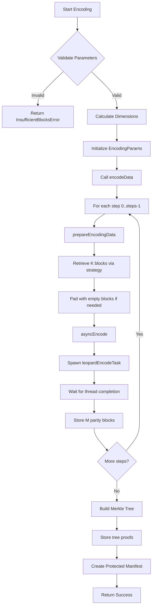
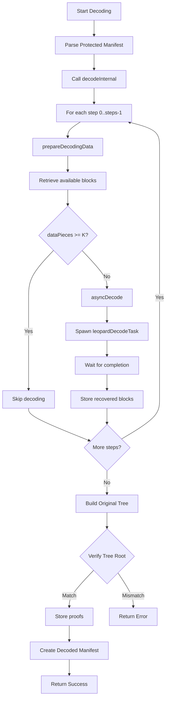
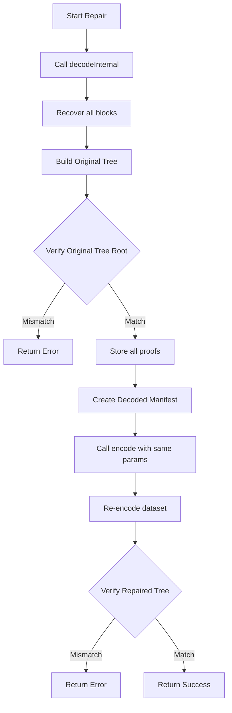

# Erasure Coding Module Specification

## 1. Purpose and Scope

### Purpose
The erasure coding module provides data redundancy and recovery capabilities. It encodes original data blocks into erasure-protected datasets using systematic Reed-Solomon erasure coding, enabling data recovery even when some blocks are unavailable or corrupted.

The Codex implementation uses the Leopard library, but alternative Reed-Solomon implementations may be used as well.

### Scope
- Encoding datasets into erasure-protected formats using k data blocks + m parity blocks
- Decoding erasure-protected datasets back to original data
- Repairing incomplete or damaged datasets
- Merkle tree generation and verification for data integrity

### Boundaries and Limitations
- Requires at least k blocks to reconstruct original data
- Dataset must be padded to meet encoding requirements
- Maximum recovery capability limited to m missing blocks
- All blocks must be of uniform size within a manifest

## 2. Interfaces

| Interface | Description | Input | Output |
|-----------|-------------|-------|---------|
| `encode()` | Encodes a manifest into erasure-protected format | `manifest: Manifest`<br>`blocks: Natural` (K)<br>`parity: Natural` (M)<br>`strategy: StrategyType` (default: SteppedStrategy) | `Future[?!Manifest]` - Protected manifest with erasure coding metadata |
| `decode()` | Decodes protected manifest to original | `encoded: Manifest` (must be protected) | `Future[?!Manifest]` - Original manifest reconstructed from available blocks |
| `repair()` | Repairs a damaged protected manifest by reconstructing full dataset | `encoded: Manifest` (protected) | `Future[?!void]` - Success/failure status |

### Internal Helper Interfaces

| Interface | Description | Input | Output |
|-----------|-------------|-------|---------|
| `asyncEncode()` | Performs async encoding using thread pool | `blockSize: int`<br>`blocksLen: int`<br>`parityLen: int`<br>`blocks: ref seq[seq[byte]]`<br>`parity: ptr UncheckedArray` | `Future[?!void]` |
| `asyncDecode()` | Performs async decoding using thread pool | `blockSize: int`<br>`blocksLen: int`<br>`parityLen: int`<br>`blocks, parity: ref seq[seq[byte]]`<br>`recovered: ptr UncheckedArray` | `Future[?!void]` |
| `getPendingBlocks()` | Creates async iterator for block retrieval | `manifest: Manifest`<br>`indices: seq[int]` | `AsyncIter[(?!Block, int)]` |

## 3. Functional Requirements

### 3.1 Systematic Erasure Coding
- Generate m parity blocks from k data blocks
- Support recovery with any k blocks from k+m total blocks
- Maintain systematic property where original data is readable without decoding
- Ensure deterministic encoding

### 3.2 Data Recovery
- Reconstruct missing data blocks from any k available blocks
- Verify recovered data against original tree root (originalTreeCid)
- Complete partial block downloads when recovery succeeds
- Store recovered blocks back to BlockStore for future access

### 3.3 Manifest Management
- Transform unprotected manifests to protected manifests with erasure coding metadata
- Preserve original metadata (filename, mimetype, dimensions)
- Generate and store merkle tree proofs for all blocks
- Support verifiable manifests with slot roots for proof generation
- Track both original and encoded dataset sizes

## 4. Non-Functional Requirements

### Performance
- **Latency**: Yield control periodically (10ms sleep) to prevent blocking

### Reliability
- **Error Handling**: 
  - Detailed error types (ErasureError, InsufficientBlocksError)
  - Proper error propagation through Result types
- **Data Integrity**:
  - Merkle tree verification for all operations
  - CID-based content addressing
  - Tree root comparison for validation

### Scalability
- Handle datasets of arbitrary size - limited only by storage
- Support configurable erasure coding parameters (k, m)
- Thread pool size configurable based on system resources
- Streaming block retrieval to avoid memory exhaustion

## 5. Internal Behavior

### 5.1 Encoding Workflow



### 5.2 Decoding Workflow



### 5.3 Repair Workflow



### 5.4 Implementation Details
#### Block Organization with Interleaving

The encoded dataset uses interleaving, where data blocks at the same position acrosss groups are processed together:

```
Interleaving Process
--------------------

Data blocks (k=4 in this example):

    -------------    -------------    -------------    -------------
    |x| | | | | |    |x| | | | | |    |x| | | | | |    |x| | | | | |
    -------------    -------------    -------------    -------------
     |                /                /                |
      \___________   |   _____________/                 |
                  \  |  /  ____________________________/
                   | | |  /
                   v v v v
                  
                  ---------         ---------
            data  |x|x|x|x|   -->   |p|p|p|p|  parity
                  ---------         ---------
                  
                                     | | | |
       _____________________________/ /  |  \_________
      /                 _____________/   |             \
     |                 /                /               |
     v                v                v                v
    -------------    -------------    -------------    -------------
    |p| | | | | |    |p| | | | | |    |p| | | | | |    |p| | | | | |
    -------------    -------------    -------------    -------------
    
Parity blocks (m parity blocks generated)
```

**Key concepts**:

- **k**: Number of original data block groups
- **m**: Number of parity block groups
- **n**: Total block groups (k + m)
- **Steps**: Number of encoding iterations, one for each data block position

The dataset is organized as:
- **Rows**: k + m total
- **Columns**: B blocks per row, where B = Steps
- **Total blocks**: (k + m) x B blocks in the encoded dataset


```
Logical Organization with interleaving:

        Position 0   Position 1   ...   Position B-1
        ----------------------------------------
Group 0  | Block 0  | Block 1   | ... | Block B-1      | Data
Group 1  | Block B  | Block B+1 | ... | Block 2B-1     | Data
...      | ...      | ...       | ... | ...            | Data
Group k-1| Block (k-1)×B | ...  | ... | Block k×B-1    | Data
         |----------|-----------|-----|----------------|
Group k  | Parity 0 | Parity 1  | ... | Parity B-1     | Parity
Group k+1| Parity B | Parity B+1| ... | Parity 2B-1    | Parity
...      | ...      | ...       | ... | ...            | Parity
Group k+m-1| Parity (m-1)×B |...| ... | Parity m×B-1   | Parity

where:
- k = number of data block groups
- m = number of parity block groups
- B = number of positions (steps) per block group
- Each column represents one encoding step
- Elements at the same position form an encoding group
```

## 6. Dependencies

### 6.1 Internal Components
| Component | Purpose | Interface |
|-----------|---------|-----------|
| `BlockStore` | Block storage and retrieval | `getBlock(cid/treeCid,index/address)`, `putBlock(blk,ttl)`, `completeBlock(address,blk)`, `putCidAndProof()`, `getCidAndProof()`, `hasBlock()`, `delBlock()` |
| `Manifest` | Dataset metadata representation | Verifiable/Protected/unprotected manifests with erasure coding metadata |
| `IndexingStrategy` | Block organization strategies | `getIndices(iteration)`, `init(strategy,firstIndex,lastIndex,iterations)` |
| `Backend` | Leopard erasure coding | `encode()`, `decode()` interfaces provided via EncoderProvider/DecoderProvider |
| `CodexTree` | Merkle tree operations | Tree generation, proof creation, root CID calculation |
| `MerkleTree[H,K]` | Generic merkle tree | `getProof(index)`, `reconstructRoot()`, `verify()` with configurable hash function |
| `BlockType` | Block data structure | CID-based block representation with data payload |


### 6.2 Helper Functions
| Function | Purpose | Input | Output |
|----------|---------|-------|---------|
| `putSomeProofs()` | Store merkle proofs for specific indices | `store: BlockStore`<br>`tree: CodexTree`<br>`iter: Iter[int/Natural]` | `Future[?!void]` |
| `putAllProofs()` | Store all merkle proofs for a tree | `store: BlockStore`<br>`tree: CodexTree` | `Future[?!void]` |

## 7. Data Models

### 7.1 Core Types

#### Erasure Object
```nim
type Erasure* = ref object
  taskPool: Taskpool
  encoderProvider*: EncoderProvider
  decoderProvider*: DecoderProvider
  store*: BlockStore
```

#### EncodingParams
```nim
type EncodingParams = object
  ecK: Natural           # Number of data blocks (K)
  ecM: Natural           # Number of parity blocks (M)
  rounded: Natural       # Dataset rounded to multiple of K
  steps: Natural         # Number of encoding iterations (steps)
  blocksCount: Natural   # Total blocks after encoding
  strategy: StrategyType # Indexing strategy used
```

### 7.2 Task Types

#### EncodeTask
```nim
type EncodeTask = object
  success: Atomic[bool]                                # Operation success flag
  erasure: ptr Erasure                                 # Erasure instance
  blocks: ptr UncheckedArray[ptr UncheckedArray[byte]] # Input data blocks
  parity: ptr UncheckedArray[ptr UncheckedArray[byte]] # Output parity blocks
  blockSize: int                                       # Size of each block
  blocksLen: int                                       # Number of data blocks (K)
  parityLen: int                                       # Number of parity blocks (M)
  signal: ThreadSignalPtr                              # Completion signal
```

#### DecodeTask
```nim
type DecodeTask = object
  success: Atomic[bool]                                   # Operation success flag
  erasure: ptr Erasure                                    # Erasure instance
  blocks: ptr UncheckedArray[ptr UncheckedArray[byte]]    # Available data blocks
  parity: ptr UncheckedArray[ptr UncheckedArray[byte]]    # Available parity blocks
  recovered: ptr UncheckedArray[ptr UncheckedArray[byte]] # Recovered blocks output
  blockSize: int                                          # Size of each block
  blocksLen: int                                          # Number of data blocks (K)
  parityLen: int                                          # Number of parity blocks (M)
  recoveredLen: int                                       # Number of recovered blocks
  signal: ThreadSignalPtr                                 # Completion signal
```

### 7.3 Error Types

```nim
type
  ErasureError* = object of CodexError
    # Base error type for erasure coding operations
  
  InsufficientBlocksError* = object of ErasureError
    # Raised when insufficient blocks for encoding
    minSize*: NBytes  # Minimum dataset size required
```

### 7.4 Manifest

#### Protected and Verifiable Manifest Fields
```nim
case protected: bool
of true:
  ecK: int                        # Number of data blocks
  ecM: int                        # Number of parity blocks
  originalTreeCid: Cid            # CID of original dataset tree
  originalDatasetSize: NBytes     # Size before erasure coding
  protectedStrategy: StrategyType # Strategy used for encoding
  
  case verifiable: bool
  of true:
    verifyRoot: Cid                  # Root of verification tree
    slotRoots: seq[Cid]              # Individual slot roots
    cellSize: NBytes                 # Size of verification cells
    verifiableStrategy: StrategyType # Strategy for verification
```

### 7.5 Indexing Strategy

```nim
type
  StrategyType* = enum
    LinearStrategy    # Sequential block grouping
    SteppedStrategy   # Interleaved block grouping
  
  IndexingStrategy* = object
    strategyType*: StrategyType
    firstIndex*: int      # Start of index range
    lastIndex*: int       # End of index range
    iterations*: int      # Number of iteration steps
    step*: int            # Step size between indices
    groupCount*: int      # Number of groups
    padBlockCount*: int   # Padding blocks per group
```

### 7.6 Supporting Types

#### BlockAddress
```nim
type BlockAddress* = object
  case leaf*: bool
  of true:
    treeCid*: Cid    # CID of the merkle tree
    index*: Natural  # Index of block in the tree
  of false:
    cid*: Cid        # Direct CID reference
```

#### Empty Block Handling
```nim
proc emptyCid*(version: CidVersion, hcodec: MultiCodec, dcodec: MultiCodec): ?!Cid
  # Returns CID representing empty content for padding
```

#### Merkle Tree Types
```nim
type
  CodexTree* = MerkleTree[Poseidon2Hash, PoseidonKeysEnum]
  CodexProof* = MerkleProof[Poseidon2Hash, PoseidonKeysEnum]
  
  MerkleTree*[H, K] = ref object of RootObj
    layers*: seq[seq[H]]        # Tree layers from leaves to root
    compress*: CompressFn[H, K] # Hash compression function
    zero*: H                    # Zero/empty value
    
  MerkleProof*[H, K] = ref object of RootObj
    index*: int                 # Leaf index, starting from 0
    path*: seq[H]               # Proof path from bottom to top
    nleaves*: int               # Total number of leaves
    compress*: CompressFn[H, K] # Compress function
    zero*: H                    # Zero value
```

### 7.7 System Constants
- **DefaultBlockSize**: 65536 bytes

### 7.8 Supported Hash Codecs
- **Sha256HashCodec**: SHA2-256 hash function
- **Sha512HashCodec**: SHA2-512 hash function
- **Pos2Bn128SpngCodec**: Poseidon2 sponge construction
- **Pos2Bn128MrklCodec**: Poseidon2 merkle tree construction

### 7.9 Codex-Specific Codecs
- **ManifestCodec**: For manifest encoding
- **DatasetRootCodec**: For dataset root CIDs
- **BlockCodec**: For block encoding
- **SlotRootCodec**: For slot root CIDs
- **SlotProvingRootCodec**: For proving root CIDs
- **CodexSlotCellCodec**: For slot cell encoding
