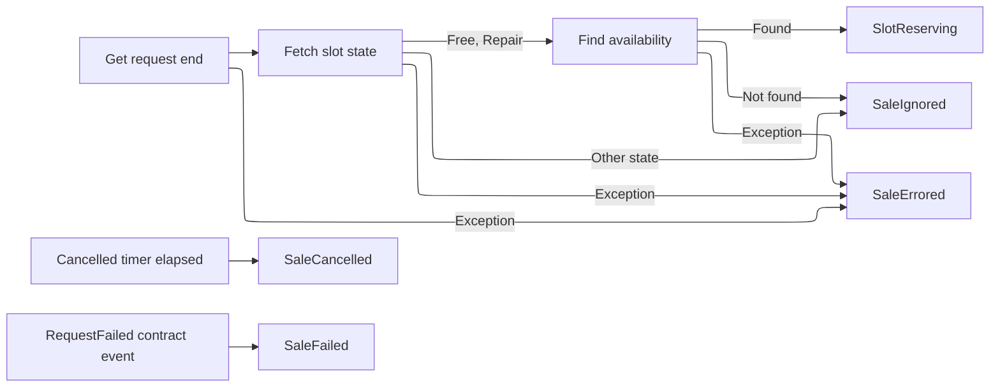
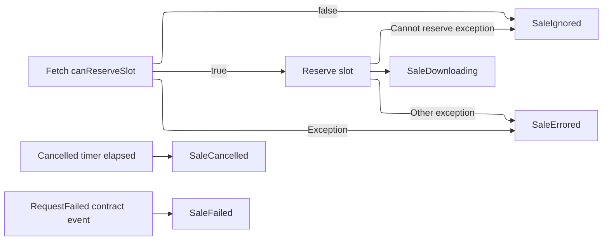
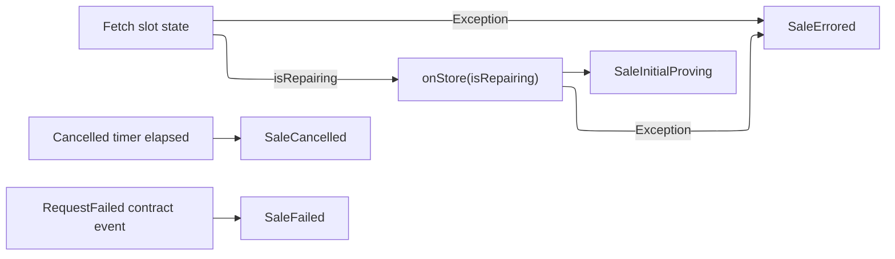
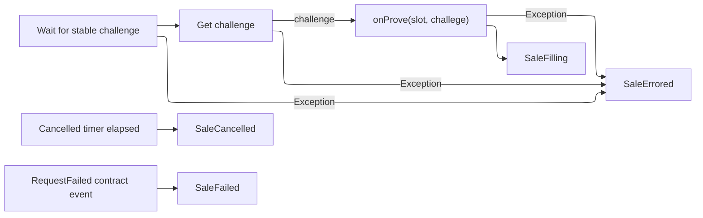
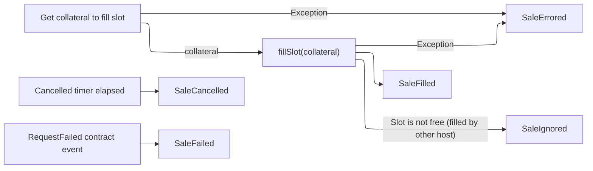
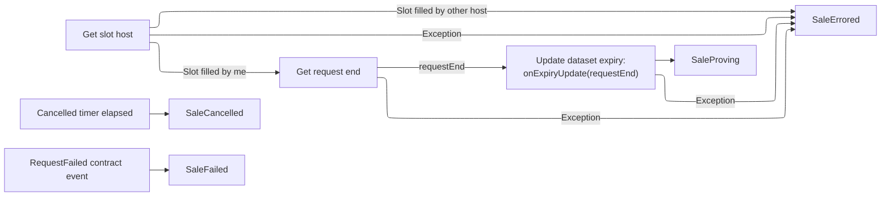
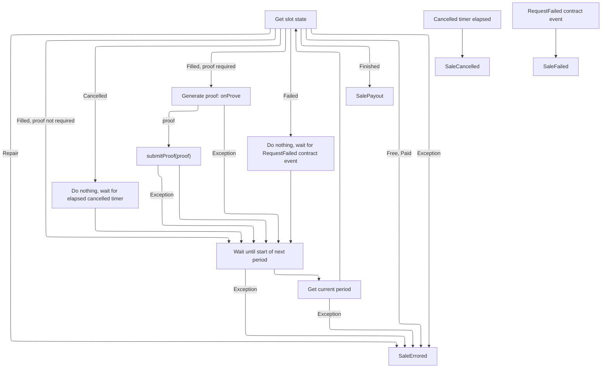
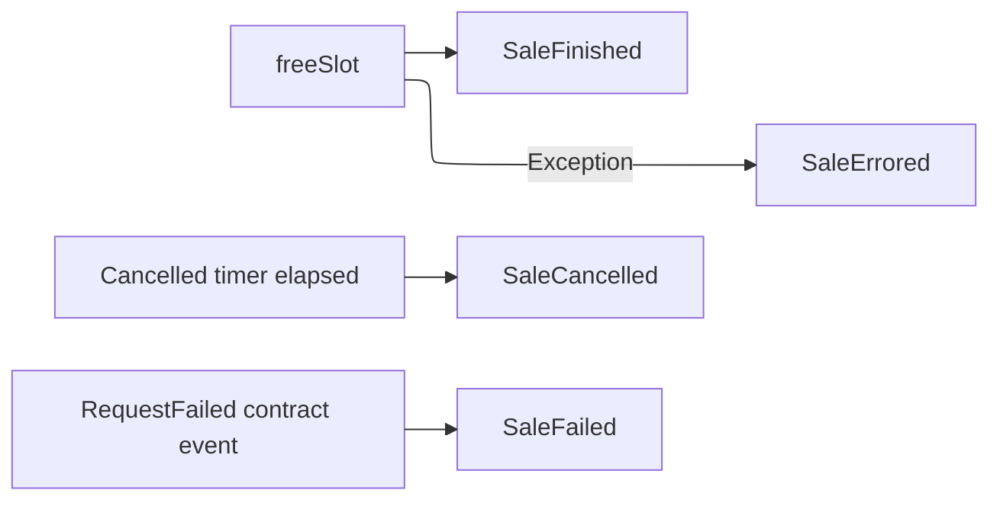
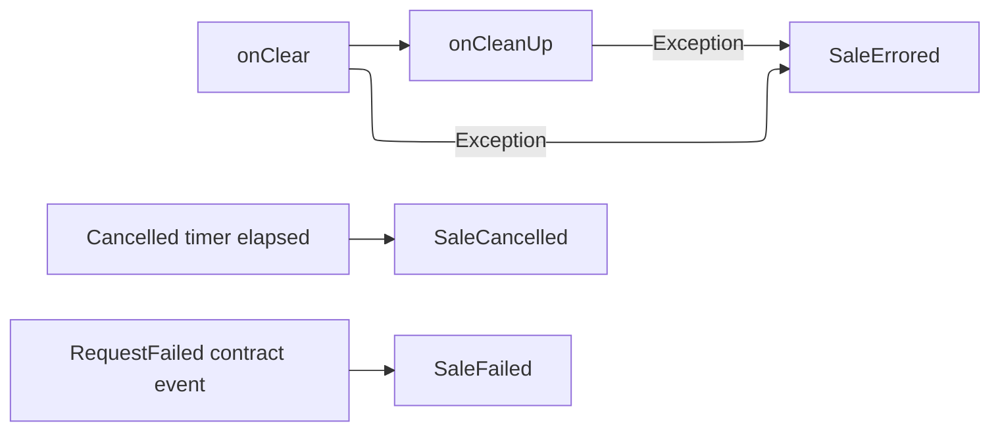

# Sales module specification

## 1. Purpose and Scope

The Sales module manages the full lifecycle of offering storage capacity on the Codex marketplace.

A host declares an `Availability` describing the space, duration, price, and collateral they commit. When a `StorageRequest` from the marketplace matches these criteria, the host creates a `Reservation` to store a slot from that request, a portion of data assigned to this host, as part of a dataset distributed across multiple nodes. Each hosted slot runs in its own state machine, handling reservation, data storage, proof submission, and eventual payout or cleanup. 

The module operates both for new requests and for ongoing ones, such as when a slot must be repaired.

## 2. Interfaces

| Interface (Nim)                                              | Description                                                | Input                                               | Output                |
| ------------------------------------------------------------ | ---------------------------------------------------------- | --------------------------------------------------- | --------------------- |
| `proc new*(_: type Sales, market: Market, clock: Clock, repo: RepoStore): Sales` | Create the Sales controller.                             | `market: Market`, `clock: Clock`, `repo: RepoStore` | `Sales`               |
| `proc new*(_: type Sales, market: Market, clock: Clock, repo: RepoStore, simulateProofFailures: int): Sales` | Same as above with simulated proving failures for testing. | `market`, `clock`, `repo`, `simulateProofFailures`  | `Sales`               |
| `proc start*(sales: Sales) {.async.}`                        | Start Sales.                                             | `sales: Sales`                                      | `Future[void]`        |
| `proc stop*(sales: Sales) {.async.}`                         | Stop Sales.                                              | `sales: Sales`                                      | `Future[void]`        |
| `proc load*(sales: Sales) {.async.}`                         | Recovery mode.                                           | `sales: Sales`                                      | `Future[void]`        |
| `proc mySlots*(sales: Sales): Future[seq[Slot]] {.async.}`   | List current slots owned by this host.                   | `sales: Sales`                                      | `Future[seq[Slot]]`   |
| `proc activeSale*(sales: Sales, slotId: SlotId): Future[?SalesAgent] {.async.}` | Get the running agent for a slot, if any.                | `sales: Sales`, `slotId: SlotId`                    | `Future[?SalesAgent]` |

### 2.2 Sales state `run` methods

| Interface (Nim)                                              | Description                                                  | Input                                             | Output           |
| ------------------------------------------------------------ | ------------------------------------------------------------ | ------------------------------------------------- | ---------------- |
| `method run*(state: SalePreparing, machine: Machine): Future[?State]` | Create reservation in order to prepare the sale.           | `state: SalePreparing`, `machine: Machine`        | `Future[?State]` |
| `method run*(state: SaleSlotReserving, machine: Machine): Future[?State]` | Create a reservation.                                      | `state: SaleSlotReserving`, `machine: Machine`    | `Future[?State]` |
| `method run*(state: SaleInitialProving, machine: Machine): Future[?State]` | Wait for a stable challenge for the whole period and then get the initial proof. | `state: SaleInitialProving`, `machine: Machine`   | `Future[?State]` |
| `method run*(state: SaleFilling, machine: Machine): Future[?State]` | Compute collateral and fill the slot.                      | `state: SaleFilling`, `machine: Machine`          | `Future[?State]` |
| `method run*(state: SaleFilled, machine: Machine): Future[?State]` | Post filling operations.                                   | `state: SaleFilled`, `machine: Machine`           | `Future[?State]` |
| `method run*(state: SaleProving, machine: Machine): Future[?State]` | Proving state.                                             | `state: SaleProving`, `machine: Machine`          | `Future[?State]` |
| `method run*(state: SaleProvingSimulated, machine: Machine): Future[?State]` | Proving with injected failures for testing.                | `state: SaleProvingSimulated`, `machine: Machine` | `Future[?State]` |
| `method run*(state: SalePayout, machine: Machine): Future[?State]` | Free slot and calculate collateral.                        | `state: SalePayout`, `machine: Machine`           | `Future[?State]` |
| `method run*(state: SaleFinished, machine: Machine): Future[?State]` | Terminal success.                                          | `state: SaleFinished`, `machine: Machine`         | `Future[?State]` |
| `method run*(state: SaleFailed, machine: Machine): Future[?State]` | Free the slot on the market and transition to error.       | `state: SaleFailed`, `machine: Machine`           | `Future[?State]` |
| `method run*(state: SaleCancelled, machine: Machine): Future[?State]` | Cancel path.                                               | `state: SaleCancelled`, `machine: Machine`        | `Future[?State]` |
| `method run*(state: SaleIgnored, machine: Machine): Future[?State]` | Sale ignored.                                              | `state: SaleIgnored`, `machine: Machine`          | `Future[?State]` |
| `method run*(state: SaleErrored, machine: Machine): Future[?State]` | Terminal error.                                            | `state: SaleErrored`, `machine: Machine`          | `Future[?State]` |
| `method run*(state: SaleUnknown, machine: Machine): Future[?State]` | Recovery state.                                            | `state: SaleUnknown`, `machine: Machine`          | `Future[?State]` |
| `method run*(state: SaleDownloading, machine: Machine): Future[?State]` | Stream and persist data via `onStore`.                     | `state: SaleDownloading`, `machine: Machine`      | `Future[?State]` |

### 2.3 Reservations API

| Interface (Nim)                                              | Description                                                  | Input                                                        | Output                  |
| ------------------------------------------------------------ | ------------------------------------------------------------ | ------------------------------------------------------------ | ----------------------- |
| `proc findAvailability*(self: Reservations, size, duration: uint64, pricePerBytePerSecond, collateralPerByte: UInt256, validUntil: SecondsSince1970): Future[?Availability]` | Looks up a compatible Availability.                        | `size`, `duration`, `pricePerBytePerSecond`, `collateralPerByte`, `validUntil` | `Future[?Availability]` |
| `method createReservation*(self: Reservations, availabilityId: AvailabilityId, slotSize: uint64, requestId: RequestId, slotIndex: uint64, collateralPerByte: UInt256, validUntil: SecondsSince1970): Future[?!Reservation]` | Creates a reservation on the given Availability.           | `availabilityId`, `slotSize`, `requestId`, `slotIndex`, `collateralPerByte`, `validUntil` | `Future[?!Reservation]` |
| `proc deleteReservation*(self: Reservations, reservationId: ReservationId, availabilityId: AvailabilityId, returnedCollateral: ?UInt256 = UInt256.none): Future[?!void]` | Deletes the reservation and returns remaining bytes (and optional returned collateral) to the Availability. | `reservationId`, `availabilityId`, `returnedCollateral?`     | `Future[?!void]`        |
| `proc returnBytesToAvailability*(self: Reservations, availabilityId: AvailabilityId, reservationId: ReservationId, bytes: uint64): Future[?!void]` | Returns excess bytes from the reservation back to the Availability. | `availabilityId`, `reservationId`, `bytes`                   | `Future[?!void]`        |
| `proc all*(self: Reservations, T: type SomeStorableObject): Future[?!seq[T]]` | Fetches all persisted objects of type T (Availability or Reservation). | `T` (type)                                                   | `Future[?!seq[T]]`      |
| `proc `OnAvailabilitySaved=`*(self: Reservations, cb: OnAvailabilitySaved)` | Sets the callback invoked when an Availability is updated. | `cb: OnAvailabilitySaved`                                    | `void`                  |

### 2.4 Sales External Hooks

| hook            | Description                                                  | Signature                                                    |
| ---------------- | ------------------------------------------------------------ | ------------------------------------------------------------ |
| `onStore`        | Download and persist the slot’s data using a streaming blocks callback. | `(request: StorageRequest, expiry: SecondsSince1970, slot: uint64, blocksCb: BlocksCb, isRepairing: bool) -> Future[?!void]` |
| `onProve`        | Produce a proof for the given challenge.                   | `(slot: Slot, challenge: ProofChallenge) -> Future[?!Groth16Proof]` |
| `onExpiryUpdate` | Notify the final expiry for the content.                   | `(rootCid: Cid, expiry: SecondsSince1970) -> Future[?!void]` |
| `onClear`        | Inform that a sale is over and the slot can be cleaned up in the node client side. | `(request: StorageRequest, slotIndex: uint64) -> void`       |
| `onSale`         | Inform that a sale has been taken for this host.           | `(request: StorageRequest, slotIndex: uint64) -> void`       |

## 3. Functional Requirements

### 3.1 Reservations

- Maintain `Availability` and `Reservation` records
- Match incoming slot requests to the correct availability using prioritisation rules
- Lock capacity and collateral when creating a reservation
- Release reserved bytes progressively during download and free all remaining resources in terminal states

### 3.2 Marketplace Interaction

- Reserve slots through the `marketplace`
- Fill reserved slots when data is stored and proven
- Submit proofs periodically
- React to events from the `marketplace`

### 3.3 Data Handling

- Download and persist slot data via the `onStore` hook
- Track committed bytes and update reservations accordingly
- Update data expiry information via `onExpiryUpdate`

### 3.4 State

- Execute the sale state machine deterministically for both fresh and recovery flows
- Trigger cleanup hooks (`onClear`, `onCleanUp`) in terminal states

## 4. Non-functional requirements

- **Performance**
  * All operations that involve `marketplace` calls, reservations updates, and storage I/O must be asynchronous and non-blocking.
  * Proof generation should complete without blocking other sales.
  * State transitions must be fast.
- **Security**
  * Proof computation must be correct and produce results that the marketplace can deterministically verify.
- **Reliability**
  * The module must resume after restart using `load()` and `SaleUnknown` to reconstruct state from `on-chain` data.
  * Reservation bytes must be safe: the process of releasing bytes has to be carefully checked to avoid bytes reservations never being released.
    The same condition applies to collateral accounting, collateral must always be freed or marked correctly in terminal states.
  * Retry policy must be in place for all external calls (e.g., `marketplace` API).
  * Sales must recover deterministically after interruptions, reconciling local and `on-chain` state.
  * Any terminal state (`SaleFinished`, `SaleFailed`, `SaleCancelled`, `SaleIgnored`, `SaleErrored`) must trigger cleanup and collateral handling.
  * Implement a window mechanism to ensure slots from the same dataset are geographically distributed across nodes, preventing centralisation of stored data.
- **Observability**
  * Log all state transitions with `requestId`, `slotIndex`, and relevant identifiers (`slotId`, `reservationId`, `availabilityId`).
- **Scalability**
	* Dispatch a worker from the pool to handle concurrent sales state machine flows. Worker must be returned to pool after deterministic state machine result.
**Scalability**
- Dispatch a worker from the pool to handle concurrent sales state machine flows. Worker must be returned to pool after deterministic state machine result.
## 5. Internal Behaviour

## 5.1 Main behaviour

When a new slot request is received, the sales module extracts the pair `(requestId, slotIndex, …)` from the request.
A `SlotQueueItem` is then created with metadata such as `profitability`, `collateral`, `expiry`, and the `seen` flag set to `false`. This item is pushed into the `SlotQueue`, where it will be prioritised according to the ordering rules in section 5.2.1. The marketplace subscriptions behaviour is described in 5.6.

## 5.2 Slot queue

Slot queue schedules slot work and instantiates one `SalesAgent` per item with bounded concurrency.

- Accepts `(requestId, slotIndex, …)` items and orders them by priority (described below)
- Spawns one `SalesAgent` for each dequeued item, in other words, one item for one agent
- Caps concurrent agents to `maxWorkers`
- Supports pause/resume
- Allows controlled requeue when an agent finishes with `reprocessSlot`

### 5.2.1 Slot ordering

The criteria are in the following order:

1) **Unseen before seen**
   Items that have not been seen are dequeued first.

2) **More profitable first**
   Higher `profitability` wins. `profitability` is `duration * pricePerSlotPerSecond`.

3) **Less collateral first**
   The item with the smaller `collateral` wins.

4) **Later expiry first**
   If both items carry an `expiry`, the one with the greater timestamp wins.

Within a single request, per-slot items are shuffled before enqueuing so the default slot-index order does not influence priority.

### 5.2.2 Pause / Resume

When the Slot queue processes an item with `seen = true`, it means that the item was already evaluated against the current availabilities and did not match. To avoid draining the queue with untenable requests (due to insufficient availability), the queue pauses itself.

The queue resumes when:

- `OnAvailabilitySaved` fires after an availability update that increases one of: `freeSize`, `duration`, `minPricePerBytePerSecond`, or `totalRemainingCollateral`.
- A new unseen item (`seen = false`) is pushed.
- `unpause()` is called explicitly.

### 5.2.3 Reprocess

Availability matching occurs in `SalePreparing`. If no availability fits at that time, the sale is ignored with `reprocessSlot` to true, meaning that the slot is added back to the queue with the flag `seen` to true. 

### 5.2.4 Startup

On `SlotQueue.start()`, the sales module first deletes reservations associated with inactive storage requests, then starts a new `SalesAgent` for each active storage request:

- Fetch the active `on-chain` active slots.
- Delete the local reservations for slots that are not in the active list.
- Create a new agent for each slot and assign the `onCleanUp` callback.
- Start the agent in the `SaleUnknown` state.

## 5.3 `SalesAgent`

SalesAgent is the instance that executes the state machine for a single slot.

- Executes the sale state machine across the slot lifecycle
- Holds a `SalesContext` with dependencies and host hooks
- Supports crash recovery via the `SaleUnknown` state
- Handles errors by entering `SaleErrored`, which runs cleanup routines

## 5.4 SalesContext

SalesContext is a container for dependencies used by all sales.

- Provides external interfaces: `Market` (marketplace) and `Clock`
- Provides access to `Reservations`
- Provides host hooks: `onStore`, `onProve`, `onExpiryUpdate`, `onClear`, `onSale`
- Shares the `SlotQueue` handle for scheduling work
- Provides configuration such as `simulateProofFailures`
- Passed to each `SalesAgent`

## 5.5 State machine

All states move to `SaleErrored` if an error is raised.

### 5.5.1 SalePreparing

- Find a matching availability based on the following criteria: `freeSize`, `duration`, `collateralPerByte`, `minPricePerBytePerSecond` and `until`
- Create a reservation
- Move to `SaleSlotReserving` if successful
- Move to `SaleIgnored` if no availability is found or if `BytesOutOfBoundsError` is raised because of no space available.
- Move to `SaleFailed` on `RequestFailed` event from the `marketplace`
- Move to `SaleCancelled` on cancelled timer elapsed, set to storage contract expiry



### 5.5.2 `SaleSlotReserving`

- Check if the slot can be reserved
- Move to `SaleDownloading` if successful
- Move to `SaleIgnored` if `SlotReservationNotAllowedError` is raised or the slot cannot be reserved. The collateral is returned.
- Move to `SaleFailed` on `RequestFailed` event from the `marketplace`
- Move to `SaleCancelled` on cancelled timer elapsed, set to storage contract expiry



### 5.5.3 `SaleDownloading`

- Select the correct data expiry:
  - When the request is started, the request end date is used
  - Otherwise the expiry date is used
- Stream and persist data via `onStore`
- For each written batch, release bytes from the reservation
- Move to `SaleInitialProving` if successful
- Move to `SaleFailed` on `RequestFailed` event from the `marketplace`
- Move to `SaleCancelled` on cancelled timer elapsed, set to storage contract expiry
- Move to `SaleFilled` on `SlotFilled` event from the `marketplace`



### 5.5.4 `SaleInitialProving`

- Wait for a stable initial challenge
- Produce the initial proof via `onProve`
- Move to `SaleFilling` if successful
- Move to `SaleFailed` on `RequestFailed` event from the `marketplace`
- Move to `SaleCancelled` on cancelled timer elapsed, set to storage contract expiry




### 5.5.5 `SaleFilling`

- Get the slot collateral
- Fill the slot
- Move to `SaleFilled` if successful
- Move to `SaleIgnored` on `SlotStateMismatchError`. The collateral is returned.
- Move to `SaleFailed` on `RequestFailed` event from the `marketplace`
- Move to `SaleCancelled` on cancelled timer elapsed, set to storage contract expiry



### 5.5.6 `SaleFilled`

- Ensure that the current host has filled the slot by checking the signer address
- Notify by calling `onFilled` hook
- Call `onExpiryUpdate` to change the data expiry from expiry date to request end date
- Move to `SaleProving` (or `SaleProvingSimulated` for simulated mode)
- Move to `SaleFailed` on `RequestFailed` event from the `marketplace`
- Move to `SaleCancelled` on cancelled timer elapsed, set to storage contract expiry



### 5.5.7 `SaleProving`

- For each period: fetch challenge, call `onProve`, and submit proof
- Move to `SalePayout` when the slot request ends
- Re-raise `SlotFreedError` when the slot is freed
- Raise `SlotNotFilledError` when the slot is not filled
- Move to `SaleFailed` on `RequestFailed` event from the `marketplace`
- Move to `SaleCancelled` on cancelled timer elapsed, set to storage contract expiry



### 5.5.8 `SaleProvingSimulated`

- Submit invalid proofs every `N` periods (`failEveryNProofs` in configuration) to test failure scenarios

### 5.5.9 `SalePayout`

- Get the current collateral and try to free the slot to ensure that the slot is freed after payout.
- Forward the returned collateral to cleanup
- Move to `SaleFinished` if successful
- Move to `SaleFailed` on `RequestFailed` event from the `marketplace`
- Move to `SaleCancelled` on cancelled timer elapsed, set to storage contract expiry



### 5.5.10 `SaleFinished`

- Call `onClear` hook
- Call `onCleanUp` hook



### 5.5.11 `SaleFailed`

- Free the slot
- Move to `SaleErrored` with the failure message

### 5.5.12 `SaleCancelled`

- Ensure that the node hosting the slot frees the slot
- Call `onClear` hook
- Call `onCleanUp` hook with the current collateral

### 5.5.13 `SaleIgnored`

- Call `onCleanUp` hook with the current collateral

### 5.5.14 `SaleErrored`

- Call `onClear` hook
- Call `onCleanUp` hook

### 5.5.15 `SaleUnknown`

- Recovery entry: get the `on-chain` state and jump to the appropriate state

## 5.6 Marketplace subscriptions

The sales module subscribes to on-chain events to keep the queue and agents consistent.

### 5.6.1 `StorageRequested`

When the marketplace signals a new request, the sales module:

- Computes collateral for free slots.
- Creates per-slot `SlotQueueItem` entries (one per `slotIndex`) with `seen = false`.
- Pushes the items into the `SlotQueue`.

### 5.6.2 `SlotFreed`

When the marketplace signals a freed slot (needs repair), the sales module:

- Retrieves the request data for the `requestId`.
- Computes collateral for repair.
- Creates a `SlotQueueItem`.
- Pushes the item into the `SlotQueue`.

### 5.6.3 `RequestCancelled`

When a request is cancelled, the sales module removes all queue items for that `requestId`.

### 5.6.4 `RequestFulfilled`

When a request is fulfilled, the sales module removes all queue items for that `requestId` and notifies active agents bound to the request.

### 5.6.5 `RequestFailed`

When a request fails, the sales module removes all queue items for that `requestId` and notifies active agents bound to the request.

### 5.6.6 `SlotFilled`

When a slot is filled, the sales module removes the queue item for that specific `(requestId, slotIndex)` and notifies the active agent for that slot.

### 5.6.7 `SlotReservationsFull`

When the marketplace signals that reservations are full, the sales module removes the queue item for that specific `(requestId, slotIndex)`.


## 5.7 Reservations

The Reservations module manages both Availabilities and Reservations. When an Availability is created, it reserves bytes in the storage module so no other modules can use those bytes. Before a dataset for a slot is downloaded, a Reservation is created, and the freeSize of the Availability is reduced. When bytes are downloaded, the reservation of those bytes in the storage module is released. Accounting of both reserved bytes in the storage module and freeSize in the Availability are cleaned up upon completion of the state machine.

```
                                                                   +--------------------------------------+
                                                                   |            RESERVATION               |
+---------------------------------------------------+              |--------------------------------------|
|            AVAILABILITY                           |              | ReservationId  | id             | PK |
|---------------------------------------------------|              |--------------------------------------|
| AvailabilityId   | id                       | PK  |<-||-------o<-| AvailabilityId | availabilityId | FK |
|---------------------------------------------------|              |--------------------------------------|
| UInt256          | totalSize                |     |              | UInt256        | size           |    |
|---------------------------------------------------|              |--------------------------------------|
| UInt256          | freeSize                 |     |              | UInt256        | slotIndex      |    |
|---------------------------------------------------|              +--------------------------------------+
| UInt256          | duration                 |     |
|---------------------------------------------------|
| UInt256          | minPricePerBytePerSecond |     |
|---------------------------------------------------|
| UInt256          | totalCollateral          |     |
|---------------------------------------------------|
| UInt256          | totalRemainingCollateral |     |
+---------------------------------------------------+
```

## 5.8 Hooks

- **onStore**: streams data into the node’s storage
- **onProve**: produces proofs for initial and periodic proving
- **onExpiryUpdate**: notifies the client node of a change in the expiry data
- **onSale**: notifies that the host is now responsible for the slot
- **onClear**: notification emitted once the state machine has concluded; used to reconcile Availability bytes and reserved bytes in the storage module.

## 5.9 Error handling

- Always catch `CancelledError` from `nim-chronos` and log a trace, exiting gracefully
- Catch `CatchableError`, log it, and route to `SaleErrored`

## 5.10 Cleanup

Cleanup releases resources held by a sales agent and optionally requeues the slot.

- Return reserved bytes to the availability if a reservation exists
- Delete the reservation and return any remaining collateral
- If `reprocessSlot` is true, push the slot back into the queue marked as seen
- Remove the agent from the sales set and track the removal future

## 6. Dependencies

- **marketplace**: Interface to the Codex marketplace, used for slot reservation (`reserveSlot`), freeing (`freeSlot`), querying slot/request state, retrieving expiry, and handling payouts/collateral.
- **statemachine**: Internal framework used to implement the sales lifecycle (`SaleSlotReserving`, `SaleDownloading`, `SaleInitialProving`, etc.).
- **questionable**: Provides `Option` and `Result` types for optional values and error propagation.
- **nim-chronos**: Async runtime for futures, I/O scheduling, and cooperative cancellation handling.
- **leveldb**: On-disk key/value store backing persistence for reservations.

### 6.1 Marketplace interactions

```nim
method requestState*(market: Market, requestId: RequestId): Future[?RequestState]
method requestExpiresAt*(market: Market, id: RequestId): Future[SecondsSince1970]
method getRequestEnd*(market: Market, id: RequestId): Future[SecondsSince1970]
method slotState*(market: Market, slotId: SlotId): Future[SlotState]
method getHost*(market: Market, requestId: RequestId, slotIndex: uint64): Future[?Address]
method getSigner*(market: Market): Future[Address]
method currentCollateral*(market: Market, slotId: SlotId): Future[UInt256]
method freeSlot*(market: Market, slotId: SlotId)
method submitProof*(market: Market, id: SlotId, proof: Groth16Proof)
method fillSlot*(
    market: Market,
    requestId: RequestId,
    slotIndex: uint64,
    proof: Groth16Proof,
    collateral: UInt256
)
method mySlots*(market: Market): Future[seq[SlotId]]
method reserveSlot*(market: Market, requestId: RequestId, slotIndex: uint64)
```

## 7. Data Models

## 7.1 Reservation

```nim
type
  ReservationId* = distinct array[32, byte]

  Reservation* = ref object
    id* {.serialize.}: ReservationId
    availabilityId* {.serialize.}: AvailabilityId
    size* {.serialize.}: uint64
    requestId* {.serialize.}: RequestId
    slotIndex* {.serialize.}: uint64
    validUntil* {.serialize.}: SecondsSince1970
```

## 7.2 Availability

```nim
type
  AvailabilityId* = distinct array[32, byte]

  Availability* = ref object
    id* {.serialize.}: AvailabilityId
    totalSize* {.serialize.}: uint64
    freeSize* {.serialize.}: uint64
    duration* {.serialize.}: uint64
    minPricePerBytePerSecond* {.serialize.}: UInt256
    totalCollateral {.serialize.}: UInt256
    totalRemainingCollateral* {.serialize.}: UInt256
    # If set to false, the availability will not accept new slots.
    # If enabled, it will not impact any existing slots that are already being hosted.
    enabled* {.serialize.}: bool
    # Specifies the latest timestamp after which the availability will no longer host any slots.
    # If set to 0, there will be no restrictions.
    until* {.serialize.}: SecondsSince1970
```

## 7.3 SalesData

```nim
type SalesData* = ref object
  requestId*: RequestId
  ask*: StorageAsk
  request*: ?StorageRequest
  slotIndex*: uint64
  cancelled*: Future[void]
  reservation*: ?Reservation
  slotQueueItem*: ?SlotQueueItem
```

## 7.4 SalesContext

```nim
type
  SalesContext* = ref object
    market*: Market
    clock*: Clock
    # Sales-level callbacks. Closure will be overwritten each time a slot is
    # processed.
    onStore*: ?OnStore
    onClear*: ?OnClear
    onSale*: ?OnSale
    onProve*: ?OnProve
    onExpiryUpdate*: ?OnExpiryUpdate
    reservations*: Reservations
    slotQueue*: SlotQueue
    simulateProofFailures*: int
```


## 7.5 SlotQueue

```nim
type
  SlotQueueItem* = object
    requestId: RequestId
    slotIndex: uint16
    slotSize: uint64
    duration: uint64
    pricePerBytePerSecond: UInt256
    collateral: UInt256 # Collateral computed
    expiry: ?uint64
    seen: bool

  SlotQueue* = ref object
    maxWorkers: int
    onProcessSlot: ?OnProcessSlot
    queue: AsyncHeapQueue[SlotQueueItem]
    running: bool
    trackedFutures: TrackedFutures
    unpaused: AsyncEvent

  SlotQueueError* = object of CodexError
  SlotQueueItemExistsError* = object of SlotQueueError
  SlotQueueItemNotExistsError* = object of SlotQueueError
  SlotsOutOfRangeError* = object of SlotQueueError
  QueueNotRunningError* = object of SlotQueueError
```