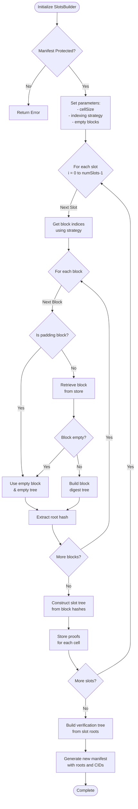
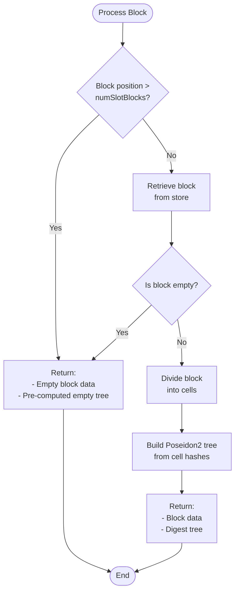

# Slot Builder Module Specification

## 1. Purpose and Scope

### Purpose
The slot builder module partitions dataset blocks into slots, builds individual Merkle trees for each slot enabling cell-level proof generation, and constructs a root verification tree over all slot roots.

### Scope
- Build block-level digest trees from raw data
- Construct slot trees from block digests
- Create verification trees from slot roots
- Manage empty blocks and padding
- Store cryptographic proofs in the block store

### Boundaries and Limitations
- Requires protected manifests
- Block size must be divisible by cell size
- Number of blocks must be divisible by number of slots
- Slot cells must be padded to the nearest power of two

## 2. Interfaces

| Interface | Description | Input | Output |
|-----------|-------------|-------|--------|
| `new[T, H]()` | Creates a new SlotsBuilder instance | `store: BlockStore`, `manifest: Manifest`, `strategy: IndexingStrategy`, `cellSize: NBytes` | `?!SlotsBuilder[T, H]` |
| `buildSlot(slotIndex)` | Builds a single slot tree and stores proofs | `slotIndex: Natural` | `Future[?!H]` (slot root hash) |
| `buildSlots()` | Builds all slot trees for the dataset | None | `Future[?!void]` |
| `buildManifest()` | Builds a new verifiable manifest with slot roots | None | `Future[?!Manifest]` |
| `buildBlockTree(blkIdx, slotPos)` | Builds digest tree for a specific block | `blkIdx: Natural`, `slotPos: Natural` | `Future[?!(seq[byte], T)]` |
| `buildSlotTree(slotIndex)` | Constructs slot tree from block hashes | `slotIndex: Natural` | `Future[?!T]` |
| `getCellHashes(slotIndex)` | Retrieves cell hashes for a slot | `slotIndex: Natural` | `Future[?!seq[H]]` |
| `buildVerifyTree(slotRoots)` | Creates verification tree from slot roots | `slotRoots: openArray[H]` | `?!T` |

## 3. Functional Requirements

### 3.1 **Slot Tree Construction**
- Construct a Poseidon2-based Merkle tree for each slot from block digest hashes
- Insert padding blocks with empty data for incomplete slots
- Ensure slot trees have power-of-two number of leaves
- Apply position-aware hashing using compression keys (bottom layer, odd position)

### 3.2 **Verification Tree Generation**
- Build a root verification tree from all slot roots using Poseidon2
- Compare stored verification roots against reconstructed roots to validate integrity

### 3.3 **Proof Storage**
- Store Poseidon2 Merkle inclusion proofs for each cell in the block store
- Associate proofs with corresponding tree CIDs
- Provide proof retrieval functionality for verification requests
- Encode proofs into a serializable format for persistent storage

### 3.4 **Manifest Generation**
- Generate updated manifests containing:
    - Slot roots
    - Verification roots
    - Cell size
    - Strategy type
- Preserve all original manifest metadata
- Generate CIDs for slot and verification trees using codec identifiers

## 4. Non-Functional Requirements

### 4.1 Reliability
- **Error Handling**: Proper error propagation through Result types

### 4.2 Scalability
- **Large Datasets**: Handle datasets of arbitrary size - limited only by storage

### 4.3 Security
- **Cryptographic Integrity**: From all data cells, construct a Merkle tree using Poseidon2 hash function over the BN254 curve
- **Proof Verification**: Use Poseidon2-based Merkle proofs to verify data cells in commited root
- **Tamper Detection**: Detect data modification by comparing stored and recomputed root hash
- **Position-Aware Hashing**: Incorporate compression keys based on tree position, to prevent structural collisions and enhance Merkle tree security

## 5. Internal Behavior

### 5.1 Slot Building Workflow



### 5.2 Block Tree Construction



#### Poseidon2 Compression Details
The Poseidon2-based Merkle tree uses position-aware compression keys to prevent structural collisions:
- **Default (`KeyNone`, 0x0)**: Used for even-indexed (non-leaf) nodes
- **Bottom Layer (`KeyBottomLayer`, 0x1)**: Used for even-indexed leaves when compressing at the bottom layer
- **Odd Positions (`KeyOdd`, 0x2)**: Used for odd-indexed internal (non-leaf) nodes
- **Odd + Bottom Layer (`KeyOddAndBottomLayer`, 0x3)**: Used for odd-indexed leaves in the bottom layer

By binding the compression key to both node type (leaf or internal) and position (even or odd), this scheme ensures that identical child hashes in different positions cannot produce the same parent hash, thereby eliminating cross-branch collisions and strengthening Merkle tree security.

### 5.3 Helper Functions

| Function | Purpose | Location |
|----------|---------|----------|
| `slotIndicesIter(slot)` | Returns iterator for slot block indices | SlotsBuilder |
| `slotIndices(slot)` | Returns sequence of slot block indices | SlotsBuilder |
| `digestTree(data, cellSize)` | Creates Poseidon2 tree from block data divided into cells | Tree implementation |
| `toSlotCids()` | Converts slot roots to CIDs | Converters |
| `toEncodableProof()` | Converts proof to storable format | Proof types |
| `compress(x, y, key)` | Poseidon2 compression with position-aware key | Poseidon2 module |
| `merkleTreeWorker()` | Builds tree layers recursively | MerkleTree |

## 6. Dependencies

### Internal Components

| Component | Purpose | Interface |
|-----------|---------|-----------|
| `BlockStore` | Block storage and retrieval | `getBlock(treeCid, index)`, `putCidAndProof(treeCid, index, cellCid, proof)` |
| `Manifest` | Manifest metadata | Verifiable/Protected/unprotected manifests with slot configuration |
| `MerkleTree` | Generic merkle tree operations | `init(leaves)`, `getProof(index)`, `root()`, `verify()` |
| `IndexingStrategy` | Block organization patterns | `getIndices(slot)`, `init(strategy, firstIndex, lastIndex, iterations)` |
| `Converters` | Type conversion utilities | `toSlotCid()`, `fromSlotCid()`, `toVerifyCid()`, `fromVerifyCid()`, `toCellCid()` |
| `AsyncIter` | Asynchronous iteration support | Iterator protocol for async block retrieval |
| `Poseidon2` module | Poseidon2 cryptographic primitives | `compress(x, y, key)`, tree initialization, proof generation |
| `RNG` | Random number generation | Used for tree verification sampling |

## 7. Data Models

### 7.1 Core Types

#### SlotsBuilder Object
```nim
type SlotsBuilder*[T, H] = ref object of RootObj
  store: BlockStore              # Storage backend for blocks
  manifest: Manifest             # Current dataset manifest
  strategy: IndexingStrategy     # Block indexing strategy
  cellSize: NBytes               # Size of each cell in bytes
  numSlotBlocks: Natural         # Blocks per slot (including padding)
  slotRoots: seq[H]              # Computed slot root hashes
  emptyBlock: seq[byte]          # Pre-allocated empty block data
  verifiableTree: ?T             # Optional verification tree
  emptyDigestTree: T             # Pre-computed empty block tree
```

#### Type Aliases
```nim
type Poseidon2Builder* = SlotsBuilder[Poseidon2Tree, Poseidon2Hash]
  # Specialized builder using Poseidon2 hash function
  # - Poseidon2Tree: MerkleTree with BN254 prime field elements
  # - Poseidon2Hash: BN254 prime field element (Bn254Fr)
```

### 7.2 Proof Types

#### Sample
```nim
type Sample*[H] = object
  cellData*: seq[H]              # Cell hash data
  merklePaths*: seq[H]           # Merkle proof paths
```

#### PublicInputs
```nim
type PublicInputs*[H] = object
  slotIndex*: int                # Slot identifier
  datasetRoot*: H                # Root hash of entire dataset
  entropy*: H                    # Randomness for sampling
```

#### ProofInputs
```nim
type ProofInputs*[H] = object
  entropy*: H                    # Randomness value
  datasetRoot*: H                # Dataset root hash
  slotIndex*: Natural            # Slot identifier
  slotRoot*: H                   # Root hash of slot
  nCellsPerSlot*: Natural        # Cell count per slot
  nSlotsPerDataSet*: Natural     # Total slot count
  slotProof*: seq[H]             # Inclusion proof for slot in dataset
  samples*: seq[Sample[H]]       # Cell inclusion proofs
```

#### Poseidon2Proof
```nim
type Poseidon2Proof* = MerkleProof[Poseidon2Hash, PoseidonKeysEnum]
```

### 7.3 Configuration Parameters

#### Cell and Block Sizes
```nim
const
  DefaultCellSize* = 2048.NBytes   # Default 2KB cells
  DefaultBlockSize* = 65536.NBytes # Default 64KB blocks
```

### 7.4 Supporting Types

#### Verifiable Manifest Metadata
```nim
# Manifest fields when verifiable = true
type Manifest* = object
  #...
  case verifiable*: bool
  of true:
    verifyRoot*: Cid                  # Root of verification tree
    slotRoots*: seq[Cid]              # Individual slot roots
    cellSize*: NBytes                 # Size of verification cells
    verifiableStrategy*: StrategyType # Verification strategy
```

### 7.5 Tree Types

#### Generic Merkle Tree
```nim
type MerkleTree*[H, K] = ref object of RootObj
  layers*: seq[seq[H]]          # Tree layers from leaves to root
  compress*: CompressFn[H, K]   # Hash compression function
  zero*: H                      # Zero/empty value
```

#### Poseidon2 Hash Types
```nim
type
  Bn254Fr* = F                  # Field element from BN254 curve
  Poseidon2Hash* = Bn254Fr       # Hash output is a field element
  
  PoseidonKeysEnum* = enum       # Compression key selection
    KeyNone                      # 0x0 - default key
    KeyBottomLayer               # 0x1 - bottom layer of tree
    KeyOdd                       # 0x2 - odd position
    KeyOddAndBottomLayer         # 0x3 - odd position at bottom
```

#### Poseidon2 Trees
```nim
type
  Poseidon2Tree* = MerkleTree[Poseidon2Hash, PoseidonKeysEnum]
    # Merkle tree using Poseidon2 hash with position-aware compression
  
  Poseidon2Proof* = MerkleProof[Poseidon2Hash, PoseidonKeysEnum]
    # Merkle proof for Poseidon2 trees
```

#### Poseidon2 Constants
```nim
const
  Poseidon2Zero* = zero
  KeyNoneF = F.fromHex("0x0")
  KeyBottomLayerF = F.fromHex("0x1")
  KeyOddF = F.fromHex("0x2")
  KeyOddAndBottomLayerF = F.fromHex("0x3")
```

#### Tree Initialization
```nim
func init*(T: type Poseidon2Tree, leaves: openArray[Poseidon2Hash]): ?!Poseidon2Tree
  # Initialize tree from hash leaves
  
func init*(T: type Poseidon2Tree, leaves: openArray[array[31, byte]]): ?!Poseidon2Tree
  # Initialize tree from byte array leaves
  
proc fromNodes*(T: type Poseidon2Tree, nodes: openArray[Poseidon2Hash], nleaves: int): ?!Poseidon2Tree
  # Reconstruct tree from all nodes (for verification)
```

### 7.6 CID Types and Codecs

#### Supported CID Codecs
```nim
const
  SlotRootCodec* = multiCodec("codex-slot-root")           # Codec for slot root CIDs
  SlotProvingRootCodec* = multiCodec("codex-proving-root") # Codec for proving root CIDs  
  CodexSlotCellCodec* = multiCodec("codex-slot-cell")      # Codec for slot cell CIDs
```

#### CID Conversion Functions
```nim
proc toSlotCid*(root: H): ?!Cid
  # Convert slot root hash to CID
  
proc fromSlotCid*(cid: Cid): ?!H
  # Extract slot root hash from CID
  
proc toVerifyCid*(root: H): ?!Cid
  # Convert verification root to CID
  
proc fromVerifyCid*(cid: Cid): ?!H
  # Extract verification root from CID
```
