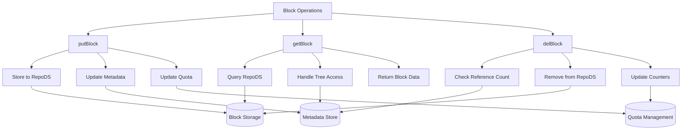
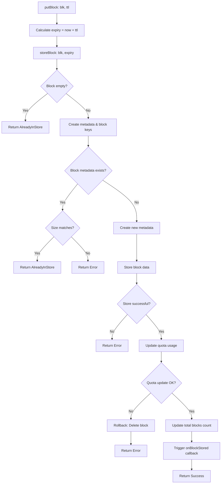
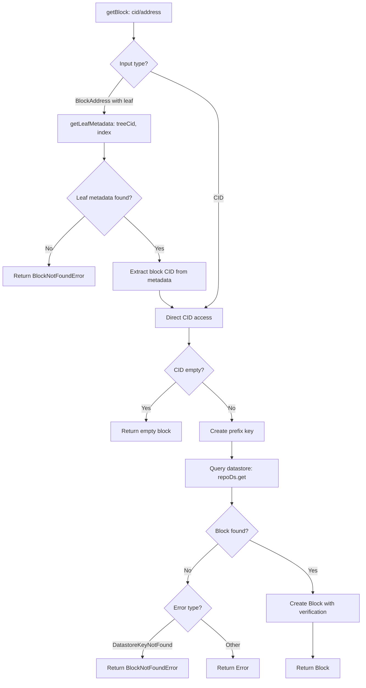
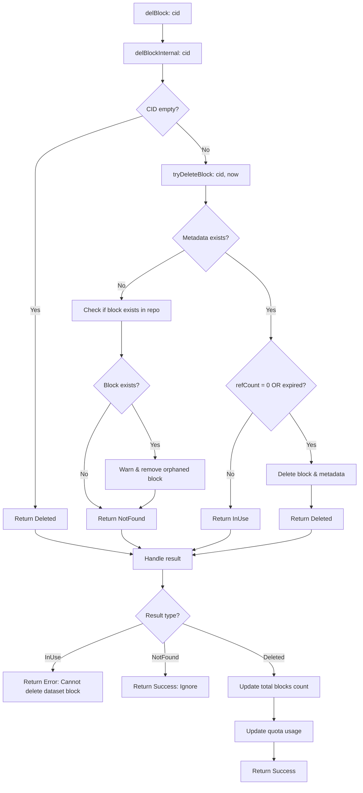

## 1. Purpose and Scope

The **Store Module** serves as the core storage abstraction in **Nim-Codex**, providing a unified interface for storing and retrieving **content-addressed blocks** and associated metadata.

The primary design goal is to decouple storage operations from the underlying datastore semantics by introducing the `BlockStore` interface. This interface standardizes methods for storing and retrieving both **ephemeral** and **persistent** blocks, ensuring a consistent API across different storage backends.

Additionally, the module integrates a **maintenance engine** responsible for cleaning up expired ephemeral data according to configured policies.

This module is built on top of the generic [`DataStore (DS)` interface](https://github.com/codex-storage/nim-datastore/blob/master/datastore/datastore.nim), which is implemented by multiple backends such as SQLite, LevelDB, and the filesystem.

The DS provides a **KV-store** abstraction (`Get`, `Put`, `Delete`, `Query`), with backend-dependent guarantees. At a minimum, row-level consistency and basic batching are expected.

It also supports:

- **Namespace mounting** for isolating backend usage
- **Layering backends** (e.g., caching in front of persistent stores)
- Flexible stacking and composition of storage proxies

---

## 2. Limitations

The current implementation has several shortcomings:

- **No dataset-level operations** or advanced batching support
- **Lack of consistent locking and concurrency control**, which may lead to inconsistencies during:
    - Crashes
    - Long-running operations on block groups (e.g., reference count updates, expiration updates)

---

## 3. `BlockStore` Interface

| Method | Description | Input | Output |
| --- | --- | --- | --- |
| `getBlock(cid: Cid)` | Retrieve block by CID | CID | `Future[?!Block]` |
| `getBlock(treeCid: Cid, index: Natural)` | Retrieve block from a Merkle tree by leaf index | Tree CID, index | `Future[?!Block]` |
| `getBlock(address: BlockAddress)` | Retrieve block via unified address | BlockAddress | `Future[?!Block]` |
| `getBlockAndProof(treeCid: Cid, index: Natural)` | Retrieve block with Merkle proof | Tree CID, index | `Future[?!(Block, CodexProof)]` |
| `getCid(treeCid: Cid, index: Natural)` | Retrieve leaf CID from tree metadata | Tree CID, index | `Future[?!Cid]` |
| `getCidAndProof(treeCid: Cid, index: Natural)` | Retrieve leaf CID with inclusion proof | Tree CID, index | `Future[?!(Cid, CodexProof)]` |
| `putBlock(blk: Block, ttl: Duration)` | Store block with quota enforcement | Block, optional TTL | `Future[?!void]` |
| `putCidAndProof(treeCid: Cid, index: Natural, blkCid: Cid, proof: CodexProof)` | Store leaf metadata with ref counting | Tree CID, index, block CID, proof | `Future[?!void]` |
| `hasBlock(...)` | Check block existence (CID or tree leaf) | CID / Tree CID + index | `Future[?!bool]` |
| `delBlock(...)` | Delete block/tree leaf (with ref count checks) | CID / Tree CID + index | `Future[?!void]` |
| `ensureExpiry(...)` | Update expiry for block/tree leaf | CID / Tree CID + index, expiry timestamp | `Future[?!void]` |
| `listBlocks(blockType: BlockType)` | Iterate over stored blocks | Block type | `Future[?!SafeAsyncIter[Cid]]` |
| `getBlockExpirations(maxNumber, offset)` | Retrieve block expiry metadata | Pagination params | `Future[?!SafeAsyncIter[BlockExpiration]]` |
| `blockRefCount(cid: Cid)` | Get block reference count | CID | `Future[?!Natural]` |
| `reserve(bytes: NBytes)` | Reserve storage quota | Bytes | `Future[?!void]` |
| `release(bytes: NBytes)` | Release reserved quota | Bytes | `Future[?!void]` |
| `start()` | Initialize store | — | `Future[void]` |
| `stop()` | Gracefully shut down store | — | `Future[void]` |
| `close()` | Close underlying datastores | — | `Future[void]` |

---

## 4. Functional Requirements

**Atomic Block Operations**

- Store, retrieve, and delete operations must be atomic
- Support retrieval via:
    - Direct CID
    - Tree-based addressing (`treeCid` + index)
    - Unified block address

**Metadata Management**

- Store protocol-level metadata (e.g., sales data, storage proofs, quota usage)
- Store block-level metadata (e.g., reference counts, total block count)

**Multi-Datastore Support**

- Pluggable datastore interface supporting various backends
- Typed datastore operations for metadata type safety
- Uniform API across implementations

**Lifecycle & Maintenance**

- **BlockMaintainer** service for removing expired data
- Configurable maintenance intervals (default: 10 min)
- Batch processing (default: 1000 blocks/cycle)
- Cooperative scheduling to avoid blocking
- State tracking for large datasets

**Transaction Rollback & Error Recovery**

- Rollback for failed multi-step operations
- Consistent state restoration after failures

---

## 5. Non-Functional Requirements

**Performance**

- Batch metadata updates
- Efficient key lookups with configurable prefix lengths
- Lazy iteration and streaming for large datasets
- Support for both fast and slower storage tiers

**Security**

- Verify block content integrity upon retrieval
- Enforce quotas to prevent disk exhaustion
- Safe orphaned data cleanup

**Scalability**

- Configurable storage quotas (default: 20 GiB)
- Pagination for metadata queries
- Reference counting–based garbage collection

**Reliability**

- Metrics collection (`codex_repostore_*`)
- Auto-recovery from inconsistent states
- Graceful shutdown with resource cleanup

---

## 6. Internal Design

### Store Implementations

The Store module provides **three concrete implementations** of the `BlockStore` interface, each optimized for a specific role in the Nim-Codex architecture: **RepoStore**, **NetworkStore**, and **CacheStore**.

#### RepoStore

The **RepoStore (RS)** is a persistent `BlockStore` implementation that interfaces directly with low-level storage backends, such as hard drives and databases.

It uses two distinct `DataStore (DS)` backends:

- **FileSystem** — for storing raw block data
- **LevelDB** — for storing associated metadata

This separation ensures optimal performance, allowing block data operations to run efficiently while metadata updates benefit from a fast key-value database.

**Characteristics**:

- Persistent storage via datastore backends
- Quota management with precise usage tracking
- TTL (time-to-live) support with automated expiration
- Metadata storage for block size, reference count, and expiry
- Transaction-like operations implemented through reference counting

**Configuration**:

- `quotaMaxBytes`: Maximum storage quota
- `blockTtl`: Default TTL for stored blocks
- `postFixLen`: CID key postfix length for sharding

```python
┌─────────────────────────────────────────────────────────────┐
│                        RepoStore                            │
├─────────────────────────────────────────────────────────────┤
│  ┌─────────────┐              ┌──────────────────────────┐  │
│  │  repoDs     │              │       metaDs             │  │
│  │ (Datastore) │              │  (TypedDatastore)        │  │
│  │             │              │                          │  │
│  │ Block Data: │              │ Metadata:                │  │
│  │ - Raw bytes │              │ - BlockMetadata          │  │
│  │ - CID-keyed │              │ - LeafMetadata           │  │
│  │             │              │ - QuotaUsage             │  │
│  │             │              │ - Block counts           │  │
│  └─────────────┘              └──────────────────────────┘  │
└─────────────────────────────────────────────────────────────┘

```

---

#### NetworkStore

The **NetworkStore** is a composite `BlockStore` that combines local persistence with network-based retrieval for distributed content access.

It follows a **local-first** strategy — attempting to retrieve or store blocks locally first, and falling back to network retrieval via the Block Exchange Engine if the block is not available locally.

**Characteristics**:

- Integrates local storage with network retrieval
- Works seamlessly with the block exchange engine for peer-to-peer access
- Transparent block fetching from remote sources
- Local caching of blocks retrieved from the network for future access

```python
┌────────────────────────────────────────────────────────────┐
│                      NetworkStore                          │
├────────────────────────────────────────────────────────────┤
│                                                            │
│  ┌─────────────────┐           ┌──────────────────────┐    │
│  │ LocalStore - RS │           │   BlockExcEngine     │    │
│  │ • Store blocks  │           │ • Request blocks     │    │
│  │ • Get blocks    │           │ • Resolve blocks     │    │
│  └─────────────────┘           └──────────────────────┘    │
│           │                              │                 │
│           └──────────────┬───────────────┘                 │
│                          │                                 │
│                   ┌─────────────┐                          │
│                   │BS Interface │                          │
│                   │             │                          │
│                   │ • getBlock  │                          │
│                   │ • putBlock  │                          │
│                   │ • hasBlock  │                          │
│                   │ • delBlock  │                          │
│                   └─────────────┘                          │
└────────────────────────────────────────────────────────────┘

```

---

#### CacheStore

The **CacheStore** is an in-memory `BlockStore` implementation designed for fast access to frequently used blocks.

This store maintains **two separate LRU caches**:

1. **Block Cache** — `LruCache[Cid, Block]`
    - Stores actual block data indexed by CID
    - Acts as the primary cache for block content
2. **CID/Proof Cache** — `LruCache[(Cid, Natural), (Cid, CodexProof)]`
    - Maps `(treeCid, index)` to `(blockCid, proof)`
    - Enables efficient tree-based block access without re-fetching proofs

**Characteristics**:

- O(1) access times for cached data
- LRU eviction policy for memory management
- Configurable maximum cache size
- No persistence — cache contents are lost on restart
- No TTL — blocks remain in cache until evicted

**Configuration**:

- `cacheSize`: Maximum total cache size (bytes)
- `chunkSize`: Minimum block size unit

---

### Storage Layout

| Key Pattern | Data Type | Description | Example |
| --- | --- | --- | --- |
| `repo/manifests/{XX}/{full-cid}` | Raw bytes | Manifest block data | `repo/manifests/Cd/bafy...Cd → [data]` |
| `repo/blocks/{XX}/{full-cid}` | Raw bytes | Block data | `repo/blocks/Ab/bafy...Ab → [data]` |
| `meta/ttl/{cid}` | BlockMetadata | Expiry, size, refCount | `meta/ttl/bafy... → {...}` |
| `meta/proof/{treeCid}/{index}` | LeafMetadata | Merkle proof for leaf | `meta/proof/bafy.../42 → {...}` |
| `meta/total` | Natural | Total stored blocks | `meta/total → 12039` |
| `meta/quota/used` | NBytes | Used quota | `meta/quota/used → 52428800` |
| `meta/quota/reserved` | NBytes | Reserved quota | `meta/quota/reserved → 104857600` |

---

### WorkFlows
Following flow chart summarises how put, get, and delete operations interact with the shared block storage, metadata store, and quota management systems



#### PutBlock
The following flow chart shows how a block is deleted when it is unused or expired, including metadata cleanup and quota/counter updates



---

#### GetBlock
The following flow chart explains how a block is retrieved by CID or tree reference, resolving metadata if necessary, and returning the block or an error



---

#### DelBlock
The following flow chart shows how a block is deleted when it is unused or expired, including metadata cleanup and quota/counter updates



---

## 7. Data Models

### Stores

```
RepoStore* = ref object of BlockStore
  postFixLen*: int
  repoDs*: Datastore
  metaDs*: TypedDatastore
  clock*: Clock
  quotaMaxBytes*: NBytes
  quotaUsage*: QuotaUsage
  totalBlocks*: Natural
  blockTtl*: Duration
  started*: bool

NetworkStore* = ref object of BlockStore
  engine*: BlockExcEngine
  localStore*: BlockStore

CacheStore* = ref object of BlockStore
  currentSize*: NBytes
  size*: NBytes
  cache: LruCache[Cid, Block]
  cidAndProofCache: LruCache[(Cid, Natural), (Cid, CodexProof)]

```

### Metadata Types

```
BlockMetadata* {.serialize.} = object
  expiry*: SecondsSince1970
  size*: NBytes
  refCount*: Natural

LeafMetadata* {.serialize.} = object
  blkCid*: Cid
  proof*: CodexProof

BlockExpiration* {.serialize.} = object
  cid*: Cid
  expiry*: SecondsSince1970

QuotaUsage* {.serialize.} = object
  used*: NBytes
  reserved*: NBytes

```

---

## 8. Dependencies

### External Dependencies

| Package | Purpose | Used For | Components Using |
| --- | --- | --- | --- |
| `pkg/chronos` | Async runtime | Async procedures, futures, cancellation handling | All stores (async operations) |
| `pkg/libp2p` | P2P networking | CID types, multicodec, multihash | BlockStore, NetworkStore, KeyUtils |
| `pkg/questionable` | Error handling | `?!` Result types, optional values | All components (error propagation) |
| `pkg/datastore` | Storage abstraction | Key-value storage interface, queries | RepoStore (main storage) |
| `pkg/datastore/typedds` | Typed datastore | Type-safe serialization/deserialization | RepoStore (metadata storage) |
| `pkg/lrucache` | Memory caching | LRU cache implementation | CacheStore (block caching) |
| `pkg/metrics` | Monitoring | Prometheus metrics, gauges, counters | RepoStore (quota tracking) |
| `pkg/serde/json` | Serialization | JSON encoding/decoding | RepoStore coders |
| `pkg/stew/byteutils` | Byte utilities | Hex conversion, byte arrays | RepoStore coders |
| `pkg/stew/endians2` | Endian conversion | Little/big endian conversion | RepoStore coders |
| `pkg/chronicles` | Logging | Structured logging | QueryIterHelper |
| `pkg/upraises` | Exception safety | Exception effect tracking | KeyUtils, TreeHelper |
| `std/options` | Optional types | Option[T] for nullable values | CacheStore |
| `std/sugar` | Syntax sugar | Lambda expressions, proc shortcuts | KeyUtils, RepoStore coders |

### Internal Dependencies

| Module | Purpose | Used For | Components Using |
| --- | --- | --- | --- |
| `../blocktype` | Block types | Block/Manifest type definitions, codec info | All stores (type checking) |
| `../blockexchange` | Block exchange | Network block exchange protocols | NetworkStore |
| `../merkletree` | Merkle trees | Tree structures, proofs, hashing | BlockStore, RepoStore, TreeHelper |
| `../manifest` | Data manifests | Manifest structures, CID identification | KeyUtils, CacheStore |
| `../clock` | Time abstraction | Clock interface for time operations | BlockStore, RepoStore |
| `../systemclock` | System clock | Wall-clock time implementation | RepoStore, Maintenance |
| `../units` | Units/Types | NBytes, Duration, time units | RepoStore (quota/TTL) |
| `../errors` | Custom errors | CodexError, BlockNotFoundError | RepoStore |
| `../namespaces` | Key namespaces | Database key namespace constants | KeyUtils |
| `../utils` | General utils | Common utility functions | BlockStore, RepoStore |
| `../utils/asynciter` | Async iterators | Async iteration patterns | TreeHelper, QueryIterHelper |
| `../utils/safeasynciter` | Safe async iter | Error-safe async iteration | NetworkStore, Maintenance |
| `../utils/asyncheapqueue` | Async queue | Priority queue for async operations | NetworkStore |
| `../utils/timer` | Timer utilities | Periodic timer operations | Maintenance |
| `../utils/json` | JSON utilities | JSON helper functions | RepoStore coders |
| `../chunker` | Data chunking | Breaking data into chunks | CacheStore |
| `../logutils` | Logging utils | Logging macros and utilities | All stores |