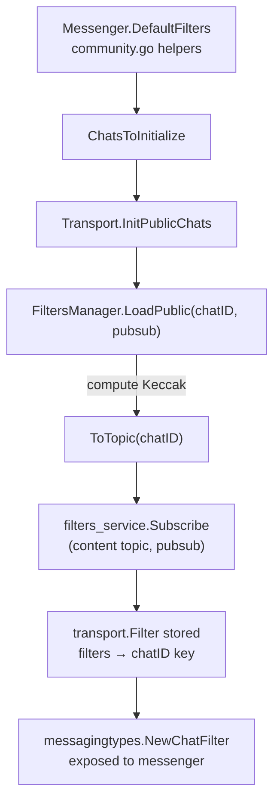
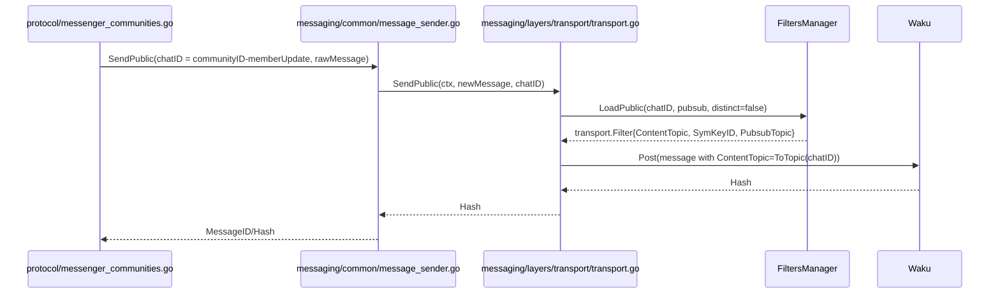
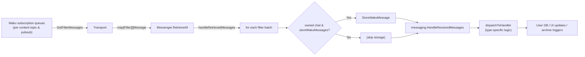

_Last updated: 2025-11-10_

Status-Go juggles several identifiers while shuttling messages between the protocol layer and Waku. This note ties the names together so future readers can reason about filters, channels, and archives without spelunking through `messenger.go`.

## Quick Glossary

| Term | Defined in | Purpose |
| --- | --- | --- |
| `ChatID` | `messaging/types/filters.go:23-48` | Status-level label for a logical chat/channel (e.g., `communityID-memberUpdate`, `communityID-general`, `0x…` contact IDs). |
| `LocalChatID` | `messagingtypes.RawMessage` (various call sites) | Field embedded in outgoing raw messages so higher layers know which chat to update; does **not** change network routing. |
| Content Topic | `messaging/layers/transport/topic.go:18-21` | Waku topic (4 bytes) derived from `ChatID` via `Keccak256(chatID)[:4]`. Real network “channel.” |
| Pubsub Topic | `messaging/types/pubsub_topics.go` (see helpers in `messagingtypes`) | Waku v2 gossipsub domain (e.g., `/waku/2/rs/16/32`, `/waku/2/default-waku/proto`). Same content topic on different pubsub topics → distinct subscriptions. |
| `transport.Filter` | `messaging/layers/transport/filter.go` | Stores `ChatID`, `FilterID`, content topic, pubsub topic, symmetric key, and flags. Returned by transport code to upper layers. |
| `messagingtypes.ChatFilter` | `messaging/types/filters.go` | Thin wrapper exposed to the protocol (`messenger.go`); created from `transport.Filter`. |

> **Rule of thumb:** The `chatID` that created a filter is the only input to `ToTopic`, so _picking a chatID_ at send time uniquely determines the Waku content topic.

## Where Chat IDs Come From

Community helpers mint deterministic chat IDs (`protocol/communities/community.go:1544-1590`):

- `Community.ChatIDs()` returns legacy per-channel identifiers (one per Status channel).
- `Community.MemberUpdateChannelID()` produces `communityID-memberUpdate`.
- `Community.UniversalChatID()` aliases the member-update channel so one topic can carry **all** community messages during the universal-channel rollout.
- Contact/discovery/chat code helpers live in `messaging/layers/transport/topic.go:27-45`.

When a community loads, `Messenger.DefaultFilters` asks to subscribe to:

1. `communityID` on the community shard’s pubsub topic.
2. `communityID-memberUpdate` (universal channel) on the same pubsub topic.
3. The hex-encoded community pubkey on both the global content topic and the default non-protected topic.
4. Optional fallbacks when the community does not publish a shard (`protocol/messenger_communities.go:2463-2480`).

These `ChatID` + pubsub pairs become actual Waku subscriptions via the FiltersManager.

## From Chat ID to Transport Filter

`FiltersManager.LoadPublic` is the main entry point (`messaging/layers/transport/filters_manager.go:540-591`):

1. Derive a map key (`chatID` or `chatID||pubsub` when `distinctByPubsub` is true).
2. If no filter exists yet, call `addSymmetric(chatID, pubsubTopic)` which:
   - Computes `ToTopic(chatID)` → content topic.
   - Calls into the Waku service (`filters_service.Subscribe`) to register the subscription.
   - Returns Waku’s `FilterID`, symmetric key id, and topic bytes.
3. Store and return the populated `transport.Filter`.

`InitCommunities` / `InitPublicChats` simply loop over `ChatsToInitialize` and call `LoadPublic` for each entry, so a single community normally yields several transport filters (legacy per-channel, universal, control/pubkey, etc.).

### Diagram: Subscription Lifecycle

## Sending Flow

All public/community traffic eventually funnels through `MessageSender.SendPublic` (`messaging/common/message_sender.go:565-681`). Important details:

1. The caller supplies `chatName` (usually `community.UniversalChatID()`).
2. After wrapping/encrypting, SendPublic calls `transport.SendPublic(ctx, newMessage, chatName)` (`messaging/layers/transport/transport.go:263-280`).
3. `transport.SendPublic` loads the filter keyed by `chatName`, then copies its symmetric key, content topic, and pubsub topic into the Waku message before posting.

Therefore **every** universal-channel message (chat, pin, magnetlink, indexCID, etc.) shares a content topic derived from `communityID-memberUpdate`. Legacy per-channel messages keep using their old chat IDs until migration completes.

### Diagram: Send Path

## Receiving Flow

Incoming envelopes land inside Waku filter queues. Retrieval proceeds as follows:

1. `transport.RetrieveRawAll` iterates over **every** registered filter, calls `api.GetFilterMessages(filter.FilterID)`, drops cached duplicates, and groups results by filter (`messaging/layers/transport/transport.go:213-258`).
2. `messenger.RetrieveAll` converts transport filters into `messagingtypes.ChatFilter` objects and feeds the map into `handleRetrievedMessages` (`protocol/messenger.go:2610`, `3042-3230`).
3. For each `(filter, []*ReceivedMessage)` pair:
   - If `filter.ChatID()` matches an owned community (legacy ID or universal ID) and `storeWakuMessages == true`, the raw Waku message is persisted for archive building (`protocol/messenger.go:3051-3082`, `protocol/communities/manager.go:4372-4405`).
   - `messaging.HandleReceivedMessages` decodes the payload(s).
   - Each decoded Status message is dispatched by type (`dispatchToHandler`), eventually ending up in chat history, member updates, archive downloads, etc.

### Diagram: Receive Path

## Persistence & Archives

- Community owners call `GetOwnedCommunitiesChatIDs()` to load every legacy per-channel ID and `GetOwnedCommunitiesUniversalChatIDs()` for the universal ID (`protocol/communities/manager.go:4372-4400`). The union is the allowlist.
- `handleRetrievedMessages` is invoked in two distinct contexts:
  1. **Live retrieval loop** (`RetrieveAll`): `storeWakuMessages = true`, `fromArchive = false`. Raw envelopes that match the allowlist are stored in `waku_messages`, and handlers run with `fromArchive=false`.
  2. **Archive replay** (`handleArchiveMessages`): `storeWakuMessages = false`, `fromArchive = true`. No new rows are written, but handlers see `fromArchive=true` to suppress live-only side effects.
- Therefore, the code only writes to `waku_messages` when both the allowlist check and the “live retrieval” flags match (case 1 above).
- Stored rows retain raw payloads, timestamps, hashes, and third-party IDs (`protocol/communities/persistence.go:889-934`). Later, archive import/export code queries by content topic and timestamp windows.

Because magnetlink/indexCID/chat traffic now shares the universal channel, one subscription per community is enough to capture everything needed for archive creation; legacy filters stay in place until every client migrates.

## Debugging Checklist

1. **Which filter saw the message?** Log `filter.ChatID()` in `handleRetrievedMessages` to confirm whether it was the universal channel, a legacy chat, or the admin/pubkey topic.
2. **Did the message get stored?** Ensure the `ChatID` appears in either `GetOwnedCommunitiesChatIDs()` or `GetOwnedCommunitiesUniversalChatIDs()` and that `storeWakuMessages` was true for this pass.
3. **Unexpected content topic?** Remember that changing the `chatID` you pass into `SendPublic` changes the `ToTopic` hash. Verify the string passed to `SendPublic` (search `LocalChatID:` in the caller).
4. **Multiple filters per community?** Enumerate `t.filters.Filters()` at runtime; it’s normal to see several entries per community because the migration keeps both universal and legacy subscriptions alive.

## appendix: Useful References

- `messaging/layers/transport/topic.go` – helpers that convert strings/public keys into Waku topics.
- `messaging/layers/transport/filters_manager.go` – how filters are registered, keyed, and updated.
- `messaging/common/message_sender.go` – wrapping, encrypting, and handing messages to the transport.
- `messaging/layers/transport/transport.go` – message retrieval, cache checks, and calls into messenger.
- `protocol/messenger_communities.go` – default chat IDs per community and subscription bootstrap.
- `protocol/messenger.go` – storage/dispatch logic (`handleRetrievedMessages`).
